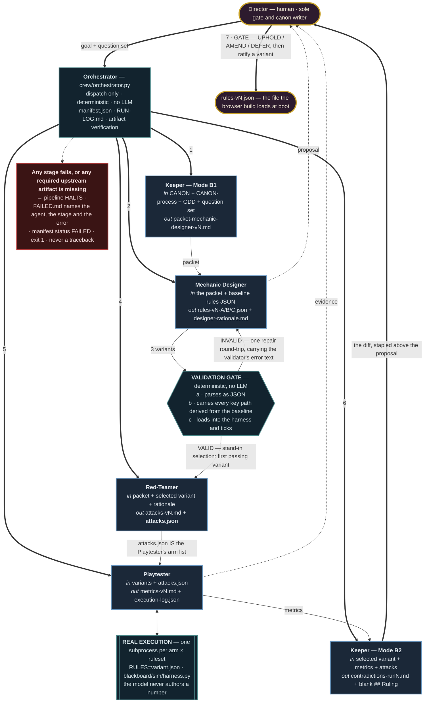
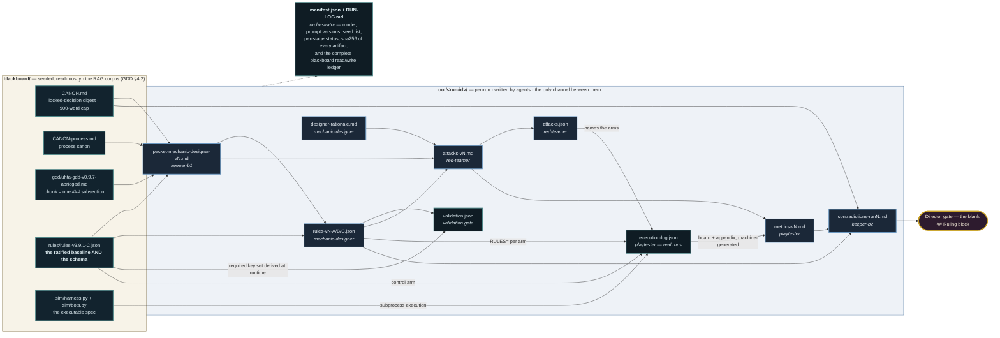

# Architecture — the uhta rules-pipeline crew

Six agent stages plus a human gate, wired through the filesystem. Both diagrams
below were rendered with `@mermaid-js/mermaid-cli` before being committed; the
sources are in `diagrams/` (`flow.mmd`, `memory.mmd`) and the rendered SVGs are
reproducible with:

```bash
cd diagrams
echo '{"args":["--no-sandbox","--disable-setuid-sandbox"]}' > pp.json
npx -y @mermaid-js/mermaid-cli -i flow.mmd   -o flow.svg   -p pp.json
npx -y @mermaid-js/mermaid-cli -i memory.mmd -o memory.svg -p pp.json
```

---

## 1. Orchestration flow — dispatch → agents → Director gate



**Reading it.** Thick edges are Orchestrator dispatch and the human gate; thin
edges are artifact flow between agents; dotted edges are what reaches the Director
for review. The two teal shapes are the deterministic pieces — the validation gate
and the real simulator execution — and they are teal specifically because they
contain no language model. Everything the crew *claims* about a ruleset passes
through one of them.

The numbers on the dispatch edges are stage numbers as recorded in
`manifest.json`. Stage 3 is the validation gate (it has no dispatch edge because
it is not an agent — it runs inside stage 2's module). Stage 7 is the Director
gate and is outside the crew.

---

## 2. Blackboard / memory-dependency map



**Reading it.** Every arrow is a file read. There are no other arrows, because
there is no other channel: no agent receives another agent's live context, no
conversation is carried forward, and `crew/blackboard.py` is the only module in
the repo that touches disk. Each read and write is appended to `RUN-LOG.md` with
a byte count and a SHA-256 prefix as it happens, so the log is not a narration of
the pattern — it is the pattern's execution trace.

Two dependencies in that graph are worth pointing at:

* **`rules-v3.9.1-C.json` is both the baseline and the schema.** The validation
  gate walks it at runtime to produce the required key-path set (203 paths in the
  current file). Nothing about the schema is typed into the crew's source, so
  when the Director ratifies a new baseline the gate follows it automatically.
* **`execution-log.json` sits between the simulator and `metrics-vN.md`.** The
  metrics document's board and appendix are generated from that log by
  `crew/agents/playtester.py`, not by the model. That is the structural reason a
  hallucinated number cannot reach the board.

---

## 3. Why no framework

The assignment permits `anthropic` and nothing else, and the constraint turned out
to be the right one for this pipeline rather than an obstacle. Three reasons the
orchestration is raw Python:

1. **The interesting part is not the routing.** Six sequential stages with one
   conditional (the repair round-trip) do not need a scheduler. What they need is
   a validation gate that derives its schema from a live file, and a Playtester
   that spawns subprocesses with a per-arm `RULES` binding. Neither is something a
   framework's agent abstraction helps with, and both are things a framework's
   tool-calling layer would have made harder to inspect.
2. **The Orchestrator's canon contract forbids judgement** (GDD §3.1:
   "dispatch only — never gates, never authors, never tunes"). Implementing it as
   Python makes the contract enforceable by construction: it never reads an
   artifact's *contents*, only existence, size, parse and hash. An LLM-backed
   manager could decide a variant looked good, and that would dissolve the gates
   the pipeline exists to protect.
3. **Determinism where it matters.** Fixed seed lists, temperature 0 for the
   Keeper, artifact hashes in the manifest. Two of the three run modes execute
   with the standard library alone.

## 4. Failure model

| Failure | What happens |
|---|---|
| Transient API error (429, 5xx, connection, timeout) | 3 attempts, exponential backoff with jitter (`crew/llm.py`) |
| Hard API error, or 3 attempts exhausted | `AgentError` → halt → `FAILED.md` names the agent and stage |
| Agent output unparseable (no JSON fence, missing heading) | `AgentError` → halt, with the specific structural defect quoted |
| All Designer variants fail the validation gate | ONE repair round-trip carrying the validator's error text; a second failure aborts |
| Required upstream artifact missing | `MissingArtifactError` naming the **producing agent** → halt |
| A probe arm raises for every seed | Recorded as an errored arm; the run continues and the metrics file is **marked incomplete** |
| A probe arm raises for some seeds | Those seeds are dropped from the aggregate and the arm is **marked partial**, with the exception text in the board's arm notes |
| Anything unanticipated | Caught at the top of `Orchestrator.run`; traceback goes to `FAILED.md`, not to the terminal |

The crew never exits with an unhandled traceback. `run_crew.py` returns 0 on
success and 1 on any halt.

The "required upstream artifact missing" row is exercisable without editing
anything: `--drop-agent <name>` removes an agent from the dispatch sequence, and
each of the five removable agents halts the run at a different, correctly-named
consumer. See the "What breaks if you remove agent X" table in the README for the
five actual halt messages.

## 5. Determinism and provenance

* **Seeds** are an explicit list, defaulted to `[0..7]` and settable with
  `--seeds N`. The uhta project standard is 20; 8 is the default here so a demo
  run finishes in about ninety seconds, and the Playtester's prompt requires it to
  state the seed count rather than describe an 8-seed result in 20-seed language.
* **Temperature** is 0 for both Keeper modes and for `attacks.json`; 0.2 for the
  Designer's rationale and the Playtester's interpretation. Three variants that
  differ by rounding are not a sweep.
* **`manifest.json`** records the model ID, the LLM backend, call and token
  counts, the prompt version string of every role, the seed list, the baseline
  file name, the validation-gate configuration, per-stage status and duration, a
  SHA-256 of every artifact in the run directory, and the complete blackboard
  read/write ledger.

## 6. The second pipeline — `run_content.py` (Assignment 4)

The repo carries a second, independent program that reuses this architecture's
plumbing rather than re-implementing it: `crew/blackboard.py` (so every corpus
read lands in the same `RUN-LOG.md` with a byte count and a hash), `crew/llm.py`
(`LiveLLM` unchanged; the mock backend subclasses `MockLLM`), and
`crew.agents.AgentError`. **`crew/` does not import `content/`** — the dependency
runs one way, which is why adding the content pipeline could not change what a
rules run does.

```
corpus (deterministic)     chunk 4 blackboard files by the GDD §4.5 rule, scope them
                           by CORPUS_POLICY (game material only), RECORD every
                           excluded section with its reason -> BM25 index
retrieval (deterministic)  per beat: TWO queries — the mechanical consequence and
                           the experience — each cut at top-1 and unioned; RECORD
                           every exclusion with its reason
generation                 Writer (temp 0.9, N candidates) -> Critic (temp 0.0,
                           verdict + quoted chunk + correction). A FAIL with no
                           correction is an AgentError.
ab                         the same beat twice: naive single-query top-1 vs the GDD
                           §4.5 two-chunk rule, both candidate sets judged by the
                           same Critic against the same chunks
assembly (deterministic)   three content files + RAG-TRACE / CRITIC-LOG /
                           VOICE-JUDGMENT / README-A4, all generated from the run
```

Three structural choices are worth naming, because they are the same choices this
document defends for the rules crew, applied to prose:

1. **The scorer is inspectable, not just accurate.** BM25 is written out in
   `content/retriever.py` (k1 1.5, b 0.75, non-negative IDF) rather than pulled
   from a package, and selection emits an exclusion list with a reason per cut —
   the Keeper's Mode-B1 contract enforced by code instead of by a prompt. The
   same contract applies one level up, at corpus scope: `CORPUS_POLICY` keeps the
   GDD's *game* material and drops its account of the pipeline (§3, §4, §7, the
   changelogs, `CANON-process.md`), and the 28 dropped chunks are listed with
   reasons rather than quietly absent. That is not tidiness — GDD §4.5 carries the
   Director's own hand-written worked narration line, and indexing it would let
   the Writer retrieve the answer instead of writing one.
2. **The evidence documents are generated, never typed.** `README-A4.md`
   interleaves static framing prose with blocks marked `[injected from this run]`,
   so a reader can tell which sentences a human wrote and which numbers an
   execution produced. Same reason the Playtester's board is generated from
   `execution-log.json`: a hallucinated number must not be able to reach the
   artifact.
3. **It ends at a human.** The rules crew stops at a blank `## Ruling`; the
   content pipeline stops at an unfilled `## Director selection`, and the
   endscreen file is marked UNRULED throughout because GDD §6 records that
   question as open.

The failure model is the one in §4, unchanged: `AgentError` and
`MissingArtifactError` both halt the run and both write a `FAILED.md` naming the
agent and the stage. The content pipeline adds four guards of its own, all
exercised by `--selftest`: a `FAIL` with no correction, a flag class outside the
four allowed, a `FAIL` that quotes no chunk, and a verdict count that does not
match the candidate count — because a silently dropped candidate is an unreviewed
line that could reach the build.

## 7. What this architecture does not do

It does not gate — the Director does. It does not touch the render layer. It runs
one question set per invocation, sequentially, with no parallelism and no
inter-agent negotiation: the pipeline shape is propose → validate → attack →
measure → diff → human, and every arrow in it is a file.
