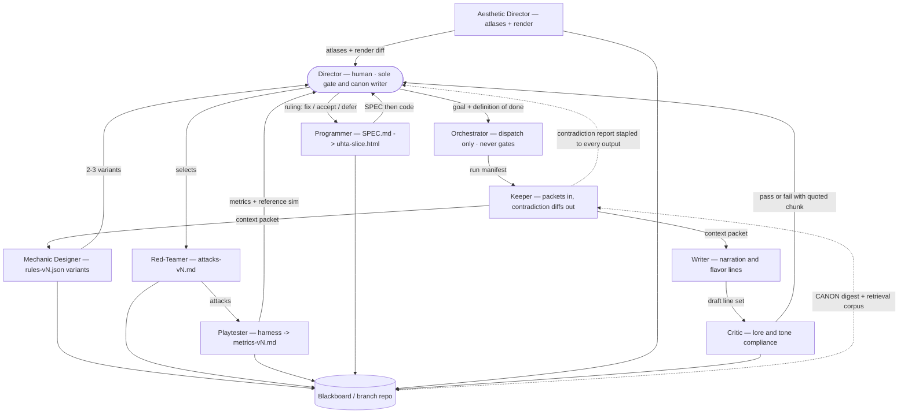
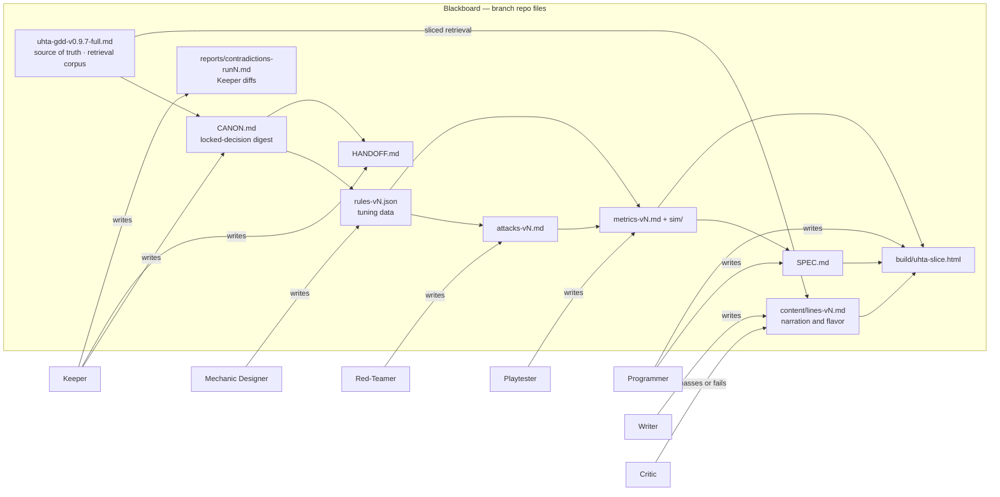

# uhta — Game Design Document (abridged submission)

> Version: 0.9.7-abridged | Date: 2026-07-28 | Author: Nicholas Rouke
> Course: ELVTR Multi-Agent AI for Game Development.
> **What changed in 0.9.7 — this revision answers the Assignment-1 grader directly.** Four written notes, five landing places, all now in the document rather than in my head: (1) **the Keeper's contradiction mechanism is specified** — report schema, flag vocabulary, the literal CANON.md diff, and the escalation rule that makes "flags, never gates" enforceable instead of decorative (§3.2); (2) **every agent's output is translated into something the player can notice**, including the two terms the grader flagged as pure system-architecture — *context packet* and *Keeper pass* (§3.4); (3) **core-vs-nice is now a build order with a stop rule** (§2.7); (4) **"playable" is a pass/fail acceptance test** rather than an adjective (§2.8); (5) **the roster is re-cut** — an Orchestrator seated for the crew assignment, a Writer and a Critic seated for the content pipeline, and the blackboard documented as a RAG corpus with GDD slicing (§3.1, §4.2). Full trace in §7.1.
> This is a condensed submission of the full working GDD (v0.9.7). **Every binding number, threshold, and condition appears in this document**; the full version adds depth, history, and the complete open-questions list, not missing substance. Accompanying artifacts: the full GDD; **thirteen ruleset generations**, counted as one committed `rules-*.json` file each, `rules-v1-B` → `rules-v3.9.1-C` (CANON names five further intermediate versions — v3.6, v3.7.1, v3.7.3, v3.8, v3.8.1 — that have no separate file in `rules/`; a blackboard-hygiene debt, not a claim); an engine-free reference simulator; **fifteen committed Keeper contradiction reports** across runs 1–19 (§3.2 is honest about the gaps); red-team passes at five gates (`attacks-v1` → `v5`) and metrics at ten; and a browser build that runs end-to-end (`uhta-slice.html`, on-load self-test 11/11) — whether it is *playable* is a separate question with a separate test (§2.8).
> **Document intent (declared):** academic/portfolio piece. Experience comps, not market comps: *Journey*/*Gris* (wordless tone), *Reus*/*Black & White* (god-game verbs). No commercial claim.

---

## 1. Summary

**Title:** uhta — *ūhta* (m.), "the last part of the night, before dawn."

**Concept:** You play an unnamed kaiju-scale being born as a counterpoint to the world's ruling god — Uhtcearu, whose grief holds people and landscape in mourning. *Counterpoint* in the musical sense: a second, independent voice set against the ruling theme — bound to answer it, not predisposed to oppose it with light. The white flame you carry is genuinely undetermined. The game asks one question: **what will you make people feel, and what will that do to the world?**

**Genre / platform:** God-game / emotional strategy. Browser (Phaser 3), keyboard + mouse. A grey-box vertical slice runs end-to-end today; whether it is *playable* by the §2.8 definition is an open question with two named blockers.

**Core loop:** Wake with a limited stamina budget, explore a self-forming world of nomadic tribes and influence them toward Hope or Fear, then Sleep — a generation passes and the world reshapes itself around what you inspired: tribes gather, settle, colonize, fight, and visibly age through three eras (nomad camps → villages → Victorian towns with clocktowers and smoking factories).

**Tone:** Mournful, mythic, wordless — **after the first dawn.** A text narrator (the teacher) speaks only during the opening cycle, naming each verb as it is first used; the words end permanently at the first sleep. Teaching-text is instrumentation, not authorship.

**Design stance:** The poles are asymmetric by design — **Fear is the easy path** (it breaks and coerces), **Hope is the hard path** (it must convert; it wins by patience and depth). The bot proxies do **not** yet confirm the direction: at rules-v3.9.1 the campaign arms measure **hope 21/25, fear 16/20** (metrics-v3.9.1 §F, which calls hope the favored leader), and the genesis-adapted bots invert the ordering in the events-OFF baseline. Both poles are winnable; the asymmetry is intent, and the proxies are being re-benchmarked before direction is read from them (§5).

## 2. Game Mechanics

**Core mechanic — emotional contagion across generations.** Your actions push people along an emotion scale, and each Sleep runs a generation of contagion you cannot micromanage — you set conditions and live with what grows. NPCs are a susceptible population on a **−12..+12 integer scale** (bands: grey 0, tentative ±1–5, devout ±6–11, zealot ±12); Sleep is a time-skip (3 sim ticks) that lets the contagion compound. Each tick an NPC sums the pressure on it and steps **at most 1**: its zealot's pull **2.0/tick**, overlapping spheres **0.8** (sphere radius 2 + floor(√group)), peer contagion **0.1/neighbor within r2, capped 0.7/tick** (apathy spreads too), and passive decay **0.4/tick** toward 0.

**Verbs** (each spends a per-wake stamina budget; when it's gone, only Sleep remains — and no action is neutral, including Wait and *where* you sleep):

| Verb | Cost | Effect |
|---|---|---|
| Walk | 0.5/tile (0.4 roaded) | Moves you; walked tiles become roads that carry **your color** |
| Flame | 2.5 | Pushes ±2.0 within r3 toward your alignment; the *save* for opposite-burned NPCs |
| Roar | half walk cost of distance | Carves a road line; unconditional Fear push 2.8 on all witnesses within r6 — whatever your color; the save for hope-burned |
| Light beacon | 3 | Places (or ignites a **discoverable ruined basin** — 5 on the map) a permanent aura (0.35/tick, r4) in your color; found basins also permanently reveal r9 of map and pay +1.5 stamina |
| Raze *(built, balance-gated)* | 4 + 0.5·devout | Massive Fear spike (2.5, r5) — Fear's hammer |
| Wait | 0 | Witnessed inaction pushes toward Apathy (0.5) |
| Sleep | ends cycle | Advances a generation; your sleeping body radiates your color (0.3/tick, r3+) — where you lie down is the last decision of every cycle |

**Key systems (implementation-precision values in force):** Burnout — same-pole pressure > Y=4 in one tick freezes an NPC grey (ring of their old color); timer X=3 sleeps to zero-out; only the opposing-valence act saves them (at 0.75 penalty, original pole). **Genesis** — the world self-forms from 55 grey nomads + 1 Fear/1 Hope founding zealot, each settling once it holds **≥5 followers** at a devout average; terminals suppressed until the world forms (aligned fraction ≥0.4, or any first settle). **Schism** — settled tribes at pop 16 with |avg|≥8 hand **half the flock** (0.5) to a same-pole daughter zealot and migrate it **≥10 tiles** away (max 6 tribes): the world grows by spreading. **Settling** roots a tribe permanently (|avg|≥6, held 1 generation); resistance 0.3 vs opposing pressure, eroded ~0.2 per adjacent road tile (floored 0.2); burnout is the only exit (exile → re-recruitable loner). **Faction fights** — rival spheres overlapping take real casualties (rate 0.2, always below +2/sleep regrowth; zealots immune) plus **battle pressure: Fear breaks** (fear_deepen **1.5**/sleep, +**0.5** against strong opposing hope, running to burnout), **Hope bends** (hope_exhaust **2.5**/sleep toward 0, reduced by depth_resist **0.5** — deep hope outlasts). **Zealot fate** — a tribe holding |avg|≥6 against its zealot for 2 generations resolves it, asymmetrically: **Hope converts** fear-zealots (bar 8.0) into a second engine; **Fear expels** hope-zealots. **Ascension** — power tiers at 12/24/40 believers: stamina cap 10→24, beacons 1→4, flame/aura radius up; the avatar visibly grows, vines (Hope) or glowing veins (Fear) thickening on its body. **Worship economy** — stamina = min(cap, 5 + 0.35·band-weighted believers + 1.5·beacons); the floor of ~5 actions guarantees a losing player always has agency.

**The antagonist — grief canon + the Grief Front.** Grief has no position on the scale because grief is not a pole — **it is the gravity**: the passive decay toward 0 (0.4/tick, scaled by dominance and idle sleeps) *is* Uhtcearu, and apathy is what grief leaves behind. His active form is gated and live: past trailing-window dominance 0.55, a visible desaturating fog bank condenses **on the winner's largest tribe** for 3 sleeps (cooldown 2). Inside it, grief exactly cancels a zealot's pull (front decay 2.0/tick = pull 2.0/tick): the shepherded **stall** — never flipped, burned, or killed — while unshepherded believers grey quickly. It wears only the dominant pole (grief never helps anyone), and it cannot fire in a do-nothing run by construction. *Grief takes the stragglers; the shepherded stand.*

**Win / loss (both are unification events, checked every tick):** WIN — your pole ≥ 0.8 of population, held 6 ticks spanning a generation, **no living opposing zealot**, and only while you act (trailing intent |S| ≥ 3 — you win by doing, never by drifting). LOSS — soft-grey + burned ≥ 0.8; the loss check always runs; **a same-tick tie goes to the loss** (your excess feeds the sky). The counts are disjoint, so a completed hold can never flip; a coasting brink can (measured 1/20 — intended).

### 2.7 Build order — what is core, what is nice, and the stop rule

*New in 0.9.7, and the direct answer to the grader's main note: "figure out early which are core that should get built first and which are nice."*

The core is one sentence: **your actions push people along an emotion scale, and each Sleep runs a generation of contagion you cannot micromanage.** Everything below the CORE line expresses that sentence rather than adding to it. The test for CORE membership is blunt: **if you remove it, is there still a game?** Four features passed; everything else is texture, and is ordered accordingly.

| Tier | Contents | Status |
|---|---|---|
| **CORE** — remove any one and there is no game | The −12..+12 contagion scale with bands; the four teaching verbs (Flame / Roar / Wait / Sleep) + Walk; generational Sleep as the time-skip; the unification win/loss check | **Built.** This is the whole game in a box: dots on a grid, values that move, a sleep button, a readout |
| **PASS 1** — makes the core legible and dramatic | Burnout + the save; Genesis (self-forming world); settling + resistance; beacons; worship→stamina + the 5-action floor; Ascension tiers; peer contagion; **the Grief Front** (the antagonist) | **Built.** The Grief Front is here rather than in Pass 2 because a loop with no opposing force is a sandbox, not a game |
| **PASS 2** — texture and consequence | Schism; road allegiance; faction fights + battle pressure; zealot fate; Raze; era art (nomad → village → Victorian); discoverable beacon basins | **Built** — and the blanket "too early" I first wrote here was lazy. Road allegiance, Raze and zealot fate paid for themselves as three of the six anti-entrenchment counter-routes; the loop needed escape hatches. **Schism, faction fights, era art and the beacon basins are the ones built too early** — surface added before anyone outside this room had read the core. See the stop rule below |
| **NICE** — ordered, unbuilt | 1. **Narrated teaching opening** (spec'd, unbuilt) · 2. Wordless endscreen · 3. Visible trader agents · 4. Interactive structures (tear-down, trade, movement blocking) · 5. Procedural map generation | **Not built.** #1 is the only one that currently blocks the Definition of Playable |
| **CUT until the loop is proven fun** | `hope_trade` as originally designed (tried, churned, disabled); road *tier* upgrade chains; kaiju-scale traversal cinematic; all final art and audio | **Out** |

**The stop rule (the part that actually changes my behavior).** The tier table's job going forward is not to describe what exists — it is to stop me. **Nothing new gets built below the CORE/PASS-1 line until the Definition of Playable checklist below passes with a stranger at the keyboard.**

> **Exception, and it is load-bearing: work required to unblock a Definition-of-Playable criterion is not "new" — it *is* the gate.** The first draft of this rule banned building the narrated opening, which is NICE #1 and which §2.8 criteria 1 and 3 are blocked on — a rule that forbade the only work that could ever satisfy it. So: NICE #1 (narrated opening) and front-render legibility are permitted and required; NICE #2–5 and everything else below the line are frozen until criterion 6 has been *asked*.

The build has thirteen ruleset generations of mechanical depth and has never been played by someone who was not me — **zero of the six criteria have been tested.** That is the real finding of the Assignment-1 feedback, and the next work queue is ordered by it: narrated opening → front render legibility → the stranger test → *then* whatever the stranger's confusion says to build.

### 2.8 Definition of Playable — the acceptance test

*"Playable" was an adjective in v0.9.6. Here it is a checklist. A stranger sits down at `uhta-slice.html` with no instruction from me, and:*

**No stranger has yet sat down, so nothing here is "Passing."** The statuses are three: **Blocked** (the criterion cannot even be asked yet), **Untested — predicted pass**, and **Untested — predicted at risk**. The predictions are mine, which is exactly the problem the table exists to expose.

| # | Criterion | Status |
|---|---|---|
| 1 | Reaches their first Sleep without being told what any key does | **Blocked** — needs the narrated opening (NICE #1) |
| 2 | Can state, unprompted, what changed in the world while they slept | **Untested — predicted pass.** The wake is the designed centerpiece; roads, settlements and tint all read *to me* |
| 3 | Can name the two things they can make people feel, and which one they are currently doing | **Blocked** — same dependency; the flame's tint carries it visually but nothing names it |
| 4 | Reaches a terminal (win or loss) within ~30 minutes / 10–30 sleeps | **Untested — predicted pass.** The evidence is a bot-measured run-length envelope of 10–30 sleeps; a bot has no wall clock, so the ~30-minute half of this criterion has never been measured at all |
| 5 | Can point at the grey fog bank and say what it is doing to them | **Untested — predicted at risk.** The front stalls camps but erases loners at ~2.4× the pre-salvage rate; the render must sell both readings |
| 6 | After losing, can say what they would do differently | **Untested — this is the one that matters.** A loss that reads as arbitrary means the contagion sim is not communicating and the whole edifice is decoration |

**Tally: 2 blocked, 4 untested (2 predicted pass, 1 predicted at risk, 1 decisive). Tested: 0 of 6.**

**Protocol once 1/3/5 clear:** five think-aloud sessions, one question at every sleep boundary ("what changed, and why?"), record sleeps-to-terminal, wall-clock time to terminal, and every moment the player looks for a UI that isn't there. Criterion 6 is the pass/fail gate for the whole design; 1–5 are prerequisites for asking it honestly.

**Scope status:** everything in CORE, PASS 1, and PASS 2 is **built and running** in the grey-box slice (48×48 tile map, fog-of-war, two sprite atlases, on-load self-test 11/11 asserting the JS port matches the reference sim). Deferred: the NICE list above; the found-beacon harness parity pass (uses only already-gated machinery); and the larger one — **the full exploit surface has not been re-attacked under the combined genesis + schism + road-allegiance model.** Each of those systems was verified in isolation. That is the binding red-team risk and it sits ahead of the parity pass (§5).

## 3. AI Architecture

One agent, one system; every output gated by the human Director; the Keeper wraps every run with a context packet and a contradiction report. Shared memory is a **blackboard** — versioned repo files (CANON.md digest, rules-vN.json, attacks-vN.md, metrics-vN.md, SPEC.md) — so no run depends on another's live context, and the same corpus doubles as the retrieval source for the content pipeline (§4.2).

### 3.1 Roster

| Agent | Owns (the one wow) | Output (definition of done) |
|---|---|---|
| **Director** (human) | Every gate, all tuning, canon | Approve / revise / redirect; commits |
| **Orchestrator** *(seated 0.9.7)* | Dispatch only — which specialist runs next, with which packet. **Never gates, never authors, never tunes** | A run manifest: agent, packet path, expected artifact path. Done = the named artifact exists and the Director has it stapled to its Keeper diff |
| **Mechanic Designer** | The tunable ruleset | 2–3 testable variants as `rules-vN.json`, each citing the GDD section it answers |
| **Red-Teamer** | Degenerate-strategy attacks | `attacks-vN.md`, every attack harness-reproducible |
| **Keeper** | Canon coherence | Context packets + contradiction reports, per the contract in §3.2 |
| **Playtester** | Engine-free reference sim + bot policies | `metrics-vN.md`; measures shape, never judges fun |
| **Programmer** | Phaser/JS build, spec before code | Build line-faithful to the sim; self-test green |
| **Aesthetic Director** *(seated v0.9.6, at the v3.9.1 gate)* | The visual language; render layer only, **never** belief math | Atlases + render diffs + docs; self-test + screenshots at gate |
| **Writer** *(seated 0.9.7)* | Game-facing text — the teacher's narration lines, era/settlement flavor, the endscreen candidate. Retrieval-grounded: reads the GDD before generating | Line sets in the game's register (short, declarative, no mythology). Done = the Critic clears it |
| **Critic** *(seated 0.9.7)* | Lore and tone compliance of generated content — the adversarial-evaluation half of the content pipeline | A pass/fail note per line set, quoting the retrieved GDD chunk that the line breaks or honors. Done = at least one catch is shown, not claimed |

**Why the Orchestrator changed status.** v0.9.6 deliberately deferred a manager layer, on the reasoning that at six sequential agents the human Director *is* the phone book. That reasoning was correct and is now expiring: at ten agents, with the content pipeline running batch generation, human routing is becoming the bottleneck the instructor named. It is seated with the narrowest possible contract — **dispatch-only** — because the gates are what make this pipeline trustworthy, and an autonomous layer that could approve anything would dissolve them. It routes; it cannot rule.

**And the obvious objection: could it be removed?** Until 0.9.7, yes — it was, for twenty-three runs, and the Director did its job by hand. No longer, for one reason: with the Writer and Critic running batch generation, the run manifest is what guarantees a generated line set reaches the Critic *before* it reaches the build. Remove it and the only thing standing between bulk-generated prose and `uhta-slice.html` is my memory of what I sent where. That is the specific breakage, and it is the honest justification for the row — not headcount.

### 3.2 The Keeper contract — what a contradiction actually does

*The grader's sharpest note on v0.9.6: the Keeper "flags, never gates," but the document never said how the flag reaches me. It is the most-run agent in the crew — **fifteen committed reports across runs 1–19** — and it was the least specified agent in the doc. Here is the mechanism, and the three places it has not held.*

**The Keeper runs three modes.** **A** — transcribe locked Director rulings into `CANON.md` (never author them). **B1** — assemble the context packet for the next run: CANON digest verbatim + only the GDD sections that run touches + a list of what was *excluded and why*, so a wrong cut is visible. **B2** — diff the returned output against CANON.md.

**The diff vocabulary — every flag is one of exactly four classes:**

| Class | Meaning |
|---|---|
| `CONTRADICTS-LOCKED` | The output violates a decision locked in CANON.md |
| `EXCEEDS-SCOPE` | New canon, names, lore — or a tuning value hard-coded in prose instead of living in data |
| `UNGROUNDED` | An assumption the agent failed to mark `[ASSUMPTION]` |
| `TUNING-ONLY` | Touches a §6 open question. Legal. Noted for attention, not correction |

**The report format** (`reports/contradictions-runN.md`, committed alongside the run's output):

```
# Keeper diff — run N | <change under review> | <target rules-vN> | date
## Change under review        — the Director's own ruling, quoted back
## Coherence verdict          — CLEAN | N flags
## Flags
###  [CLASS] output: "…" | canon: "…" (§ + CANON line) | one-line note
## Cross-file impact          — every blackboard file this change touches
## Loose ends flagged         — not contradictions; dials and orderings
## Coherence recommendation   — ratify-for-coherence / hold, with the reason.
                                A coherence verdict only: it carries no weight
                                on approval, which is the Director's alone.
```

Every flag quotes **both sides** — the offending output line and the canon line it violates, cited to a GDD section and a CANON.md line. That is the literal diff: CANON.md is versioned and each version opens with a `Delta from vN−1` section, so what the Keeper changed is auditable against what I ruled.

**Three honest notes on that schema, because it is the checkable part.** (1) It is not as old as I implied in draft: the modes and the four flag classes have been in `prompts/v1/keeper.md` since the agent's first run, but **the six-heading report skeleton stabilised at run 17** — `contradictions-run17` → `run19` share it verbatim; runs 1–16 use an earlier free-form `## Verdict:` / `## Structural checks passed` layout. Writing it down here is what fixes that. (2) The `Coherence recommendation` heading **conflicts with the Keeper's own prompt**, which ends "you flag, the Director decides — do not recommend approval or rejection," and with runs 10–16, which close "this report recommends nothing." The heading is renamed above to a coherence-only verdict, and `prompts/v1/keeper.md` needs a v2 bump to match; until it does, the prompt and the schema disagree and the prompt wins. (3) **The reports are not one-per-run.** Fifteen exist; runs 7, 9, 11 and 14 have none, and nothing has been written since run 19 — the discipline lapsed exactly when the pipeline got busy, which is the least defensible thing on this page.

**How it reaches me, and why it cannot be ignored.** The report is written to the blackboard **before** I read the agent output, and the two are stapled: I never see a proposal without its diff at the top. Then the escalation rule — **new in 0.9.7, and the thing that makes "flags, never gates" load-bearing rather than decorative:**

> **Flags never gate. But they do block silence.** A `CONTRADICTS-LOCKED` flag cannot be closed by ignoring it. Before the commit lands, the ruling must carry one of exactly three verdicts: **UPHOLD** (canon stands; the output is revised or discarded), **AMEND** (canon changes; the Keeper transcribes the new line into CANON.md with the run number as provenance), or **DEFER** (the conflict becomes a named §6 open question). There is no fourth option and "no ruling" is not a state a commit can be in.

**And the ruling has a home, because a ruling with no file is a state of mind.** It is written as a `## Ruling` block appended to that run's contradiction report — the class it answers, the verdict, and for AMEND the CANON line added with its run-number provenance. Report and ruling live in one file and land in one commit, which is what makes "no ruling is not a state a commit can be in" checkable by opening the file instead of by trusting me. The first draft of this section specified everything the ruling must contain and never said where it goes; that was the gap between a mechanism and a promise.

The Keeper still never blocks a run — it has no authority and recommends nothing about approval. What it blocks is *me quietly moving on*. **Definition of done:** every agent output has a report; every flag names a class, quotes both sides, and cites a section; report and output land in the same commit; and **every AMEND ruling appends a line to CANON's `Delta from vN−1` tagged with its run number, so the count of AMEND-tagged canon lines equals the count of AMEND gate notes** — divergence means canon has drifted. Current state: **0 AMENDs, 0 AMEND-tagged lines.** The rule is new and has not yet fired. (An earlier draft of this invariant read "CANON's version count equals the number of AMEND rulings." That is false and was false when written: CANON is at v17 and has been bumped once per *gate* since v1, while the one ruling on record is an UPHOLD. The Keeper's own audit hook did not survive its first audit.)

**The flag classes have never fired against an agent.** In fifteen committed reports the diff has returned CLEAN fifteen times: "0 canon flags" (run10), "0 flags" (run12), "0 canon contradictions" (runs 15–19). Not one report contains a `## Flags` section or a single instance of the four classes. That is either a well-behaved crew or a Keeper that agrees too easily, and the trail cannot tell you which — which is why the one contradiction on record matters, and why it was raised against **shipped code** rather than an agent proposal.

**The one live catch — and the misses that came with it.** CANON ruling #4 locked *win-vs-loss simultaneity → loss takes priority*. During the Run-23 build port the Keeper diffed the shipped sim against that line and found the code had been silently giving the **win** the tie — a `CONTRADICTS-LOCKED` against a decision I had made and believed was implemented. Ruled **UPHOLD**; fixed as data (`win_loss.tie_priority: "loss"`); verified with a synthetic tie because no organic tie had occurred in ~420 runs. Three things that flatter this less, all of which a reader with the repo will find anyway:

- **Duration.** The code had behaved that way since long before the ruling existed, but it only *contradicted locked canon* from v0.9.1 onward — through two gated generations (v3.7 → v3.9), not the eleven an earlier draft claimed.
- **The catch is also a miss.** `contradictions-run16` is a Keeper diff of `build/uhta-slice.html` against SPEC and canon, and it returned "**0 canon/spec contradictions | the Sim core is a verified-faithful port**". The bug was live in that build. Runs 17, 18 and 19 returned CLEAN over the same code. Four clean verdicts before the catch. The lesson is a mechanism change, not an apology: the B1 packet now has to name the **canon lines a port touches**, not just the GDD sections it edits — a build port was being diffed as if it were prose.
- **It has no report.** There is no `contradictions-run23.md`. The catch is recorded in the Run-23b gate note and CANON ruling #4, and nowhere else — a consequence of the post-run-19 lapse above, and the reason that lapse is now on the work queue rather than in a footnote.

A coherence agent that only ever agrees with you is a formality. This one found a real bug in shipped code by diffing a build port against one line of canon — four runs later than it should have, and without leaving the artifact that would have proved it.

### 3.3 Orchestration and shared memory



**Shared memory — the blackboard.** Cross-agent communication happens through artifacts, not through one giant context window. `CANON.md` is the compressed digest re-read at the top of every run (the anti-context-collapse mechanism *and* the token-budget control in one); full artifacts are retrieved only when a task touches their specifics. Sessions are cleared between runs; anything worth keeping is written to a file first, so no run depends on another run's live context. Prompts and outputs are versioned together (`/prompts/vN/`, `/outputs/vN/`), so any rules version traces to the exact prompt that produced it.



**Evidence the pipeline works — the Run 23 arc:** Mechanic Designer proposed three antagonist designs → Director selected the Grief Front → the Red-Teamer proved it *safe but half-dead* (measured in-sphere effect: exactly 0.000/sleep — zealot pull plus the step cap swallowed it) and specified a data-only salvage → Director ruled salvage → the fix set re-verified green across ~40 test arms (legacy equivalence 80/80; all invariants intact; hope −2/25 wins, fear untouched) → ratified, ported to the build with its render cue. The same arc surfaced the tie bug above. Propose → attack → salvage → re-verify, executed twice on one mechanic — that is what the gates are for.

### 3.4 What the player ever notices of any of this

*The grader's second note, and a fair one: `Keeper pass` and `context packet` were described in pure system-architecture terms. They are invisible in play — they should be — but invisible is not the same as inconsequential. Each one has a player-facing consequence, and if it didn't, the agent should not exist.*

| Agent artifact | What the player actually experiences |
|---|---|
| **Context packet** (Keeper B1) | A sim whose parts agree. The zealot-conversion rule, the win check, and the burnout timer were designed in three separate runs weeks apart; the packet is why a captured fear-zealot correctly counts toward your unification instead of producing a board you can see you've won but the game won't end |
| **Keeper pass** (B2 diff) | The tie you lose is the tie the endscreen told you you'd lose. This is not hypothetical — see the Run-23 catch above; without that diff, some player's unification would have quietly resolved the wrong way |
| `rules-vN.json` | Every number the game feels like — walk cost, how fast a tribe hardens, how long you have to save someone |
| `metrics-vN.md` | Tuning chosen by evidence, not argument: the deep-hope garrison that outlasts a fear siege was *measured* to hold 8 sleeps before it was shipped |
| `attacks-vN.md` | Concretely: the frontal flame siege converts **0 heads** — roads are the only channel into a settled camp, so influence costs footwork instead of standing still and holding a button |
| **`SPEC.md` → `uhta-slice.html`** (Programmer) | The slice itself — the only artifact the player ever touches. And because tuning stays in data, a change to any number after a playtest reaches the player without a code review |
| Sprite atlases | Literally everything visible — this game has no other channel |
| Writer + Critic line sets | The teacher's voice in the opening cycle: the only words in the game, and the reason a stranger can play it at all |
| **Run manifest** (Orchestrator) | Nothing directly — and that is the test it has to keep passing. Its only player-facing consequence is *ordering*: runs that reach me in the right sequence ship the narrated opening sooner. If it ever changes what the player sees, it has exceeded its contract and should be unseated |

### 3.5 Verification layers

Validation happens before anything is compiled or imported. Three layers, in depth:

1. **Keeper (coherence)** — diffs every output against `CANON.md`; a contradiction is flagged before it reaches the Director. Fifteen reports, fifteen CLEAN verdicts, one contradiction raised against shipped code (§3.2 — including where this layer failed).
2. **Playtester (behavioral)** — the harness runs each variant and each red-team attack headlessly, so a change that breaks an invariant shows up as a metric before it is ever gated. At the Run-23b gate: ~40 test arms, 80/80 legacy equivalence, 0 assert violations.
3. **Build self-test (implementation)** — `build/uhta-slice.html` runs an on-load battery (**11/11**, G1–G11) asserting the JS port reproduces the reference sim tick-for-tick.

The layers cover coherence, behaviour and implementation. **None of them covers fun**, which is the entire content of §2.8 and the reason a stranger at the keyboard is the fourth layer this crew does not yet have.

---

## 4. Technical Strategy

### 4.1 Pipeline and routing

Prompt → JSON/markdown artifact → Keeper contradiction check → harness verification → Director gate → commit → engine. Rule variants are data files the build loads; every prompt and output is versioned together; nothing auto-promotes. **Routing:** Opus-class only where output is judgment (rules, attacks); Sonnet-class for anything verifiable by running it.

### 4.2 The blackboard as a RAG corpus

The blackboard was already a retrieval store; 0.9.7 names it as one and states the retrieval discipline, because the same corpus now feeds generated content.

- **Retrieval mechanics.** A **chunk** is one GDD `###` subsection — the document is already written in named, self-contained system blocks, so the section boundary *is* the chunk boundary and no re-chunking is needed. The **index** is the blackboard file list (§3.3 diagram). A **query** is the beat being written plus the systems it touches. **Selection is Keeper Mode B1**, which already emits the list of what it excluded and why, so a wrong cut is visible rather than silent. This is deliberate section-level retrieval by a named agent, not embedding search: at this corpus size the recall problem is trivial and the precision problem is everything.
- **Sliced, not dumped.** The GDD is retrieved by section, never whole. `CANON.md` is the always-on digest; full sections load only when a run touches their specifics. Retrieval that crowds out the context window buys consistency at the cost of the reasoning you retrieved it for. Packets target ≤15K tokens and list their own exclusions. **The digest is capped at 900 words in the Keeper's Mode-A prompt and had drifted to ~1,440** — the cap is the token-budget control, and a digest that exceeds it is the first symptom of blackboard rot, so the v17 process canon is split out to `CANON-process.md` and `CANON.md` is back under the line at 896.
- **Traceable retrieval.** Each generated line set records query → retrieved chunk → output, so game-fit is inspectable rather than asserted.
- **Adversarial evaluation.** The Writer generates; the **Critic** checks the result against the retrieved chunk and quotes the line it breaks. Same structural pattern as Mechanic Designer → Red-Teamer, applied to prose instead of rules — the pipeline's one genuinely repeated shape.
- **Human as curator.** Generation is cheap and bulk; selection is mine. The Writer produces many candidates per narration beat; I pick, and the picks feed the next round's retrieval.
- **Named content gaps** (what the pipeline is *for*, not generic lore): the teacher's ~8 narration lines for the opening cycle; era-transition and settlement flavor across three eras; the endscreen text candidate. All three are content this game specifically lacks and cannot ship without.

**Worked shape — hand-run, not a pipeline output.** *The retrieval loop is not built yet (it is the 7/30 deliverable). The block below is a design example I ran by hand to fix the shape the pipeline's trace must take. It is not evidence that the pipeline works; it is the specification of what its evidence will look like.*

| Stage | Content |
|---|---|
| **Query** | Teaching line, beat 3 — the first Roar. What must the player understand at first use? |
| **Chunk A** (full GDD §2.5, the teaching-opening spec — condensed into §1 Tone here) | "…as each verb is first used, it is named and its consequence stated plainly — *the roar frightens all who witness it, whatever you intend*… short declarative lines, no mythology" |
| **Chunk B** (§2, verb table) | "Roar — carves a road line; unconditional Fear push 2.8 on all witnesses within r6 — **whatever your color**" |
| **Candidate 1** | "Your roar rolls across the valleys, a sound older than the grief above you." |
| **Critic — FAIL** | Breaks Chunk A on two counts: it is mythology, not instrumentation ("short declarative, no mythology"), and it never states the consequence, which is the only job this line has. It would also read identically in a Hope run, where the point is that it does not. |
| **Candidate 2** | "They heard you. Every one of them is afraid now — even the ones you meant to comfort." |
| **Critic — PASS** | Honors Chunk A (declarative, states the consequence at first use) and Chunk B's load-bearing clause: "whatever your color" is what the second half of the sentence carries. |

- **Voice judgment — the retrieval tweak that came out of it (design-stage).** The first hand-run retrieved **only** §2.5, the experience section, and every candidate came back generic — lines that would sit unchanged in any god-game about hope and fear. The fix was not a better prompt but a wider cut: **a narration beat now retrieves two chunks, the experience section *and* the verb's own row from the §2 table**, because the thing that makes a line belong to *this* game is the mechanical consequence (r6, "whatever your color"), not the mood. That is now the standing retrieval rule for the Writer, and it is the one change I can point at that moved output from generic to game-specific.

**Against the Assignment-4 brief.** The **source is game-anchored** — the corpus is this GDD and its locked-decision digest, not placeholder lore invented to demonstrate a pipeline. The **gaps are named, not generic** — eight opening-cycle narration lines, three eras of transition flavor, one endscreen candidate, none of which the game can ship without. **Traceability is query → chunk → output**, recorded per line set, so a reviewer can ask why a line exists and get a citation. The **Critic is the consistency-check loop**, an adversarial evaluator that must quote the chunk a line breaks or honors rather than returning an approval. And **human curation is the voice-judgment step** the pipeline deliberately does not automate: bulk generation is cheap, but which words become the only words in a wordless game is a Director ruling.

### 4.3 Budgets — projections vs. measured actuals

The original estimates priced lean single-pass runs (~15–20K tokens, $0.03–0.35 each). Measured agentic runs — agents that verify their own output with harness batteries and browser-tested self-checks — cost **4–6× that** (Mechanic Designer run: 71K actual vs 19K projected; art passes 85–135K, previously unbudgeted entirely). Revised capstone projection: **~$25–40** API-priced. The original conclusion survives strengthened: **the binding constraint is Director review time, not tokens** — a full design→attack→salvage→verify→port cycle costs single-digit dollars and paces entirely on human gate decisions.

**Human requirements:** fun-tuning by playtest (every value above is a data dial); win/loss sign-off; the difficulty stance; naming and tone; commits; deciding whether a red-team finding is a gap or a tuning question; and the three rulings in §3.2 that no agent may make.

## 5. Identified Logic Gaps (resolution trail)

1. **[RESOLVED] Worship↔energy direction** — worship *grants* stamina; a ~5-action floor preserves agency; Uhtcearu's damping is the anti-snowball; neutral-born newborns are both the loser's comeback material and the winner's maintenance burden.
2. **[RESOLVED] The emotion scale** — widened to −12..+12 with stepwise pressure; burnout as a frozen flag with save/timer semantics; zealots fixed at ±12.
3. **[RESOLVED] Roar's Fear-coding vs. Hope's need for it** — witness radius R=6: out-of-radius roaring is free terrain work, witnessed roaring is a Fear act, roaring at the hope-burned is the save.
4. **[RESOLVED] The antagonist was a hidden coefficient** (external review board's #1 finding: a deferred Uhtcearu voided balance, drama, and exploit-counter at once). Resolved by the grief canon + the Grief Front — an antagonist that is on screen, attributable, harness-proven to bite without ever bricking a run.
5. **[RESOLVED, this revision] The Keeper's flag had no destination** (Assignment-1 grader). "Flags, never gates" specified a non-authority without specifying a mechanism. Resolved by the §3.2 contract: four flag classes, a report schema, a CANON.md line-level diff, stapled delivery, and the UPHOLD / AMEND / DEFER escalation that makes an unresolved flag block a commit without giving an agent a veto. Specifying it also exposed three defects in the mechanism as run — a false audit invariant, a schema that contradicts the Keeper's own prompt, and a report trail that stops at run 19 — all now on the record in §3.2 rather than out of it.
6. **[OPEN, accepted]** Found-beacon sites shipped build-first on gated machinery — harness parity pass queued. **The full exploit surface has not been re-attacked under the combined genesis + schism + road-allegiance model** (each verified in isolation); this is the binding red-team risk. Campaign difficulty proxies need re-benchmarking under the genesis start before direction is read from them — the §1 stance is intent, not a measured result.
7. **[OPEN, and now the top of the queue]** **The loop has never been tested by a stranger.** Thirteen ruleset generations of verified mechanics, ~40-arm harness batteries, a red-team arc executed twice on one mechanic — and zero external playtests. Every claim about *feel* in this document is mine, measured against bot policies rather than people. §2.8 turns that from an embarrassment into a checklist with a gate, and records that 0 of its 6 criteria have been tested.
8. **[OPEN, process]** **The Keeper's report discipline lapsed after run 19.** Fifteen reports exist for twenty-three runs; the entire living-world and Grief-Front arc — including the one contradiction the crew has ever caught — has no committed diff. The contract in §3.2 is only worth what the trail behind it is worth.

## 6. Open Questions (deferred to playtest — dials, not gaps)

Front feel (straggler wear saturates the step cap — ~2.4× pre-salvage; render must sell "stalls camps, erases loners"); era thresholds (6/14 sleeps); the wordless endscreen (candidate: the teacher's voice returning once, at the very end); miracle polarity (a bounded counter-pole mercy is designed and on file, unratified); zealot-death cost; run-length envelope (~10–30 sleeps observed).

## 7. Provenance of key changes

### 7.1 This revision (v0.9.6-abridged → v0.9.7), traced to the Assignment-1 feedback

| Feedback | Where it landed |
|---|---|
| *"Specify what the Keeper actually does when it detects a contradiction — a structured report format, a blocking prompt, a diff against CANON.md — to make this your most technically credible agent rather than its least defined one."* | **§3.2**, all three named mechanisms adopted: the report schema, the CANON.md line-level diff with `Delta from vN−1` audit, and a blocking construct implemented as the **UPHOLD / AMEND / DEFER** escalation — chosen over a blocking *prompt* so the agent still cannot gate, but an unresolved flag still cannot reach a commit. Writing it down is also what surfaced its three defects (false audit invariant, schema-vs-prompt conflict, trail stopping at run 19), all now stated in the section rather than discovered by a reader |
| *"'Keeper pass' and 'context packet' are described in system-architecture terms without translating what the player would ever notice."* | **§3.4** — every agent artifact mapped to a player-facing consequence, those two translated first and concretely, and the two that were missing from the first draft (Programmer, Orchestrator) added, because a rule that exempts its newest agent is not a rule |
| *"Figure out early which are core that should get built first and which are nice."* | **§2.7** — CORE / PASS 1 / PASS 2 / NICE / CUT, naming *which* Pass-2 items were built too early rather than the whole tier, and a **stop rule** binding further building to the playability gate — with the carve-out that keeps the rule from forbidding the only work that can satisfy it |
| *"Really nail down what a playable version looks like so you can start testing the gameplay loop."* | **§2.8** — a six-criterion pass/fail acceptance test with current status per line (2 blocked, 4 untested: 2 predicted pass, 1 predicted at risk, 1 decisive; **0 of 6 actually tested**) and the think-aloud protocol that follows |
| *"Tweak and improve your agent list."* | **§3.1** — Orchestrator seated dispatch-only, with both the reasoning for reversing v0.9.6's deferral and the specific breakage that now makes it non-removable; Writer and Critic seated for the content pipeline; every row carries a definition of done, and §3.4 forces every role to justify itself downstream in play |

### 7.2 The prior revision (v0.7-abridged → v0.9.6), traced to the adversarial review board

Between submissions, v0.7-abridged was stress-tested by a **six-agent adversarial review board** (systems designer, narrative critic, player psychologist, feasibility lead, adversarial QA, business analyst — isolated contexts, parallel review, then cross-examination).

**No art plan (Feasibility F4 + Business Analyst F2).** A wordless, entirely-visual game had no art production plan and no budget line for visual craft. The prediction proved out: once art work began it measured as the **largest single token category (~40% of a working session)**, entirely outside the original budget. Resolution: an **Aesthetic Director** seated with a formal contract, an art pipeline as versioned artifacts, and a budget line built from measured actuals.

**The deferred antagonist (the board's #1 finding).** Four review lanes independently showed that deferring Uhtcearu's active events removed the loop's anti-snowball brake, the story's antagonist, and the counter to several named exploits at once; the narrative critic's constraint — *a hidden damping coefficient is not a character* — shaped the fix. Resolution: the grief canon plus the Grief Front, red-teamed, salvaged, and harness-verified before ratification.

**Wordless-can't-teach (Player Psychologist F1, BLOCKING).** Resolution: the pillar was rescoped to *wordless after the first dawn* — a narrated teaching opening whose voice dies permanently at the first sleep.

**The abridged-as-decoy problem (Business Analyst F1, BLOCKING).** v0.7 exported every scope-, cost-, and risk-defining table to an unseen document. This draft is built the opposite way: every binding number inline, intent declared up front, and open gaps marked OPEN rather than asserted resolved.
