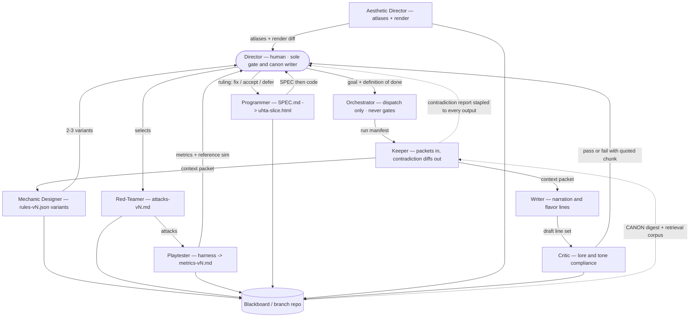
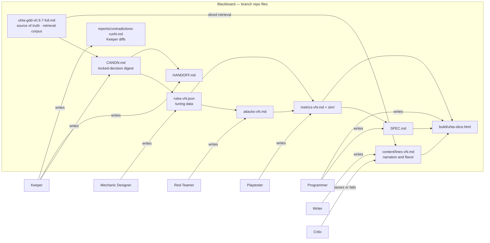

# uhta — Game Design Document

> Version: 0.9.7 (full) | Date: 2026-07-28 | Author: Nicholas Rouke
> **v0.9.7 — the Assignment-1 GDD feedback, answered in the document.** Four written notes, five landing places, all now written down rather than held in the Director's head: (1) **the Keeper's contradiction mechanism is specified** (§3.2) — a fixed report schema, a four-class flag vocabulary (`CONTRADICTS-LOCKED` / `EXCEEDS-SCOPE` / `UNGROUNDED` / `TUNING-ONLY`), a literal line-level diff against `CANON.md`, and an **UPHOLD / AMEND / DEFER** escalation rule that makes "flags, never gates" enforceable instead of decorative: an unresolved flag cannot reach a commit, yet no agent gains a veto. (2) **Every agent artifact is translated into a player-facing consequence** (§3.5), including the two terms the grader flagged as pure system-architecture — *context packet* and *Keeper pass*. (3) **Core-vs-nice becomes an explicit build-order table with a stop rule** (§2.7 — CORE / PASS 1 / PASS 2 / NICE / CUT, naming which Pass-2 items were built too early, and carving the gate work out of the rule so it does not forbid its own precondition). (4) **"Playable" becomes a six-criterion acceptance test** (§2.8), with a status per line, an honest tally of **0 of 6 tested**, and the think-aloud protocol that follows. (5) **The roster is re-cut:** the **Orchestrator is seated dispatch-only** (reversing v0.9.6's deferral now that the crew is ten agents deep), **Writer and Critic are seated** for the content pipeline, and the blackboard is documented as a **RAG corpus with GDD slicing** (§4.5).
> **v0.9.6 — the Aesthetic Director is seated.** The roster's dormant clause ("Writer and Aesthetic Director return only when the mechanic is locked") triggered at the v3.9.1 gate; the Aesthetic Director had in fact already run four art passes (eras, discoverable beacons, HD characters + avatar, clocktower/factory) under an implicit contract. §3.1 now transcribes that contract — owns the visual language, render layer only, never the Sim's belief math, done = green self-test + screenshots at the gate. §4.3 gains an art budget line from measured actuals plus a budget errata: self-verifying agentic runs cost ~4–6× the lean single-pass projections (revised capstone projection ~$25–40 API-priced; the "binding constraint is Director time, not tokens" conclusion stands). The Writer's trigger is also met (teacher narration content) but it stays unseated until its first run.
> **v0.9.5 — art pass 3: living roads, the avatar's body, HD characters.** (1) **Player roads are their own category, aged per-tile:** a freshly walked trail renders as *compacted earth* — the ground remembering you — and becomes *paver stone* after one generation passes. Restores the original "dirt → paver stone across generations" canon as per-tile aging (decoupled from era art, which no longer touches roads). Sim records only a born-sleep per tile; no balance effect. (2) **Avatar redesigned:** a larger pale humanoid (noticeably bigger than NPCs, still growing with Ascension tier), flame held aloft — with the run's identity written on its body: **glowing red veins branching across it in a Fear run; green vines climbing it in a Hope run**, pulsing, intensifying with tier. The kaiju wears what it is becoming. (3) **High-resolution characters:** the full character set re-authored at 32×32 in a second atlas (era dress preserved: hood → coif → top hat, now with staffs/satchels/canes, garment folds, face shading); tiles/fx stay 16px. Build self-test **11/11** (adds G10 road aging, G11 atlas integrity).
> **v0.9.4 — art pass 2: time made visible + found beacons.** (1) **Era progression (presentation-only):** the world's people and architecture now visibly age across generations — Nomad/Tribal → Village → Victorian town — at tunable sleep thresholds (provisional 6 and 14). NPC dress, settlement structures, and road surfaces change per era; the base land art does not. Division of labor is deliberate: **landscape tint communicates feeling; era art communicates time.** Zealots, loners, the burned, and the kaiju avatar stay era-invariant (mythic constants / timeless grey — Director may revisit). Sim untouched; era derives from sleep count at draw time. (2) **Discoverable beacons (canon restored):** five ruined basin sites scattered on the map — walk beside one and light it in your flame's color: a permanent region reveal (r9), the existing beacon aura, and the canonical found-and-lit stamina bonus (+1.5). Found sites do NOT consume the Ascension beacon cap (placed beacons only). This restores the opening-myth basin ("the flame burns weakly, but gives you strength") as a live mechanic. Marked schema 3.9.2 [BUILD-FIRST] — uses only existing gated beacon machinery; harness parity pass pending. Build self-test now **9/9** (adds G8 beacon sites, G9 era resolver).
> **v0.9.3 — Run 23–23b ratified: Uhtcearu's active events are GATED.** The Mechanic Designer's Variant A (**Grief Front**) was selected, red-teamed (attacks-v5: no-as-is — three nulls found), salvaged per the co-gated fix set (front_strength 4.0 = exact zealot-pull stall; spawn anchored on the largest dominant-pole tribe; trailing-window trigger; decay restricted to the dominant pole — grief never helps anyone), and harness-verified green (metrics-v3.9.1): 80/80 legacy equivalence, all invariants intact, hope −2/25 wins at unchanged median, fear untouched, 96% of fronts do real work. Ratified as **rules-v3.9.1-C**. Discovery: the tie ruling (v0.9.1) was found to be live-behavior-changing — v3.7 silently gave the *win* the tie; loss-priority is now enforced in the sim. §2.3/§2.6 updated; feel items in §6.
> **v0.9.2 — Director rulings (review closeout, part 2).** (1) **The opening is narrated.** The wordless pillar is scoped to *wordless after the first dawn*: the genesis/first cycle carries a text narrator — the teacher — that names each verb as it is first used and states what it does; after the first Sleep the words end for good (§1 Tone, §2.5, §2.6). Closes the board's #3 BLOCKING (wordless-can't-teach); teaching-text is instrumentation, not authorship — the endscreen question (Narrative F5) stays open in §6. (2) **Grief canon:** grief has no scale position because grief is not a pole — it is the *gravity*. Long-term grief traps people in apathy; the per-tick decay toward 0 **is** Uhtcearu's grief, the cost of living under the grey sky (§2.3). Closes Narrative F2 by declaration. (3) **Uhtcearu active events** are promoted from deferred to **in design** — Run 23 Mechanic Designer brief issued (§2.3, §2.6).
> **v0.9.1 — errata (design-review closeout, quick fixes).** Four rulings closing findings from the six-agent review board (which reviewed v0.7-abridged): (1) **the cave choice only tints the starting flame** — alignment is fully re-tintable through play; identity is emergent (§2.3, §2.5; was a §6 open question); (2) **"counterpoint" clarified in the musical sense** — a second, undetermined voice set against Uhtcearu's theme, not a hope-predisposed opposite; this reconciles "purpose-born" with "blank slate" (§1); (3) **document intent declared** — academic/portfolio piece, not a commercial pitch (§1); (4) **win-vs-loss simultaneity ruled: loss takes priority** (§2.4; mirror as `win_loss.tie_priority` in the next rules version).
> **v0.9 — Living-world sync (Class 4: Orchestrating Agentic Crews).** The design has been implemented and iterated in a playable grey-box slice; this version folds the runs-17→22 arc back into canon so the GDD is once again the single source of truth. Major changes since v0.8.1: the emotion scale widened to **−12..+12**; the world now **builds itself from a Genesis** (grey nomads + founding zealots) instead of starting pre-tribed; settlements **schism** into daughter colonies; **roads carry allegiance**; rival tribes **fight**, and sustained fighting applies **battle pressure (Fear breaks / Hope bends)**; **zealots can now fall** (Hope converts, Fear expels); **belief spreads NPC-to-NPC (peer contagion)**; **Ascension is now built and follower-driven**; and a deliberate **asymmetric difficulty** stance was adopted — **Fear is easy mode, Hope is hard mode**. AI-architecture section rewritten with a Mermaid orchestration diagram, a memory-dependency (blackboard) map, and explicit verification layers. Full per-run history lives in the branch repo (CANON.md v15+, HANDOFF.md).
> v0.8.1 — errata (Gate G2): §5 entrenchment target corrected from five to six counter-routes. v0.8 — Playtester agent added. (Superseded; retained as `uhta-gdd-v0.8-full.md`.)
> Course: ELVTR Multi-Agent AI for Game Development — Assignment 1 (7/21) / Assignment 2 GDD (7/23) / Assignment 3 agent crew (7/28) / Assignment 4 dynamic content pipeline (7/30).
> Required sections per Class 2: Summary, Mechanics (win/loss), AI Architecture, Technical Strategy. Class 4 additions: Mermaid architecture diagram, shared-memory (blackboard) documentation, verification layers.
> Supersedes: "The Awakened: Course Slice" brief. Main repo (the-awakened-v3.1) remains untouched.

---

## 1. Executive Summary

**Title:** uhta

*ūhta* (m.) — *"the last part of the night, before dawn."*

**Concept:** You play an unnamed kaiju-scale being born as a counterpoint to the world's ruling god — Uhtcearu, whose grief has held the people and the landscape in mourning. *Counterpoint* is meant in the musical sense: a second, independent voice set against the ruling theme — bound to answer it, but not predisposed to oppose it with light. The white flame is genuinely undetermined; being born *against* the sky says nothing about what you will sing back at it. The game asks one question: **what will you make people feel, and what will that do to the world?**

**Genre / platform:** God-game / emotional strategy with light exploration. Browser (Phaser 3, grey-box slice running end-to-end — *playable* by the §2.8 definition is a separate and currently open question), keyboard + mouse.

**Core loop (one sentence):** Wake with a limited budget of actions, explore a self-forming world of nomadic tribes and influence them toward Hope or Fear, then Sleep — a full generation passes and the world reshapes itself around what you inspired.

**Elevator pitch:** You wake in a cave beneath a sky made of grief. The sky is Uhtcearu — an ancient being whose sorrow has swallowed the heavens and left the world apathetic and grey. You are something new: voiceless, natureless, carrying a white flame that becomes whatever you do with it. Below, the world begins as scattered grey wanderers; a handful of zealots gather them, settle them, and colonize outward — a living world that grows whether you act or not. The humans live by emotional allegiance — Hope, Fear, or Apathy — and belief now spreads person to person like contagion. Every action you take tips the balance. When your actions run out, you sleep, and a generation passes; you wake to a world reshaped by what you inspired — the landscape, the people, your own power, and the rules themselves transformed, for better or worse. Unify the region under a single emotion and you take Uhtcearu's place in the sky. What kind of sky will you become?

**Tone:** Mournful, mythic, wordless — **after the first dawn**. The opening genesis is the one exception (ruled v0.9.2): a text narrator — the teacher — speaks while the world is still forming, naming each verb as the player first uses it and stating plainly what it does. When the first Sleep ends, the words end with it, permanently; from then on the world speaks only through color, light, and what people build. One voice, spent in the first cycle, never heard again — the silence afterward is itself a statement.

**Document intent & audience (v0.9.1):** This is an **academic/portfolio GDD** for the ELVTR course capstone. The deliverable is the playable grey-box slice plus the multi-agent method that built it — not a commercial release; no distribution or monetization is planned or claimed. Design reference points are *experience* comps, not market comps: the wordless-systems lineage of *Journey*/*Gris* for tone, *Reus*/*Black & White* for the god-game verbs.

**Design stance (v0.9):** The two poles are **asymmetric by design**. **Fear is the easy path** — it breaks and coerces, and it settles a region faster. **Hope is the hard path** — it must convert rather than coerce, and it wins by patience, presence, and depth of conviction. This is intentional identity, not an imbalance to be sanded flat.

---

## 2. Game Mechanics

### 2.1 Core mechanic

**Emotional contagion across generations.** The player is a walking emotional stimulus; NPCs are a susceptible population; sleep is a time-skip that lets the simulation compound. The one thing this game *is*: your actions push people along an emotion scale, and each Sleep runs a generation of contagion whose results you cannot micromanage — you can only set conditions and live with what grows.

Two things sharpen the core since v0.8. First, **belief now spreads NPC-to-NPC** (peer contagion), not only from zealots: hopeful neighbours pull you hopeful, fearful pull fearful, and the grey drag everyone toward apathy. The population is a medium, not just a set of targets. Second, **the world is self-forming** — it begins as unaligned grey wanderers and a few founding zealots who gather, settle, and colonize on their own. Left completely alone, the world still evolves (and, untended, drifts to the apathy loss). You are not populating an empty board; you are steering a living one.

The grey-box version of this exists today (`build/uhta-slice.html`): colored dots on a tile grid with emotion values, a handful of player actions that nudge nearby values, a "sleep" button that ticks the simulation, and a win/loss readout. Everything else in this document is expression of that core, not addition to it.

### 2.2 Player verbs / actions

Each waking cycle grants a stamina budget. Every verb spends it; when stamina is gone, the only remaining verb is Sleep. (Costs below are the current tuning values in `rules-v3.9.1-C.json`, the ratified ruleset; all remain fun-tuning dials, §6.)

| Verb | Cost | Effect |
|---|---|---|
| **Walk** | ~0.5 stamina/tile; ~0.4 on existing roads | Moves the player; every tile walked becomes a compacted road NPCs traverse faster, and roads now **carry your color** (see Road Building & Allegiance) |
| **Raise / wave the flame** | ~2.5 | Clears fog locally; applies the flame's current alignment to NPCs in radius (~3 tiles, grows with Ascension) |
| **Roar** | Half the walking cost of the distance covered | Shatters a line of tiles — fast traversal / path creation. NPCs within **witness radius R (~6 tiles)** of the line take an unconditional Fear push (~2.8) regardless of flame color; out-of-radius roaring is free terrain work. Exception: witnessed by hope-burned NPCs, the roar is the *save* (clears the flag, §2.3) |
| **Light a beacon** | ~3 | Places a permanent aura that radiates the flame's current color every generation tick, including while you sleep. **Active-beacon cap is set by your Ascension tier (1→4)**; relight to strengthen |
| **Raze** *(built; balance-gated)* | High; scales with the tribe's devotion (~4 + 0.5·devout count) | Destroys a settlement, forcibly unsettles the tribe, and pushes a massive Fear spike onto witnesses (~2.5 each within ~5 tiles). Fear's hammer against entrenchment; nearly unusable for Hope runs by design. Currently non-lethal (`burn_capable: false`) |
| **Wait / do nothing** | Free (ends an encounter) | Deliberate non-response; witnessed inaction pushes nearby NPCs toward Apathy (~0.5) |
| **Sleep** | Ends the cycle | Advances one generation — and is **positional**: the sleeping body radiates the flame's emotion over a radius (~3 tiles, grows with Ascension) for every tick of the generation. Where you sleep is the last decision of every cycle |

No action is neutral — including Wait, and including *where* you Sleep. This is the surviving spine of the original three-verb design (BUILD / DESTROY / DO NOTHING → Flame / Roar / Wait), extended until it covers every verb without exception.

**Note on Ascension verbs (now built, §2.3):** Beacon count, flame radius, sleep-aura radius, and your stamina cap all scale with your believer count. The Raise-Beacon "verb unlock" of v0.8 is superseded by a smoother **follower-driven power scale** — you don't unlock a button, your existing tools simply grow as your flock does.

### 2.3 Systems

*The systems below are specified to implementation precision — integers, thresholds, and flags, current as of `rules-v3.9.1-C.json` (schema 3.9.2), the ratified ruleset. §2.5 describes what the player experiences of them, with no numbers at all. Every value here is a tunable dial unless marked locked.*

**The tile map.** The world is an explicit square-tile grid (**48×48** in the slice). Every spatial system reads and writes tile state — each tile carries `{terrain cost, road tier, road allegiance (pole + strength), fog state, emotion tint}`. Walking spends stamina per tile (reduced by road tier); Roar carves a line; beacons and spheres are measured in tile radii; landscape contagion is a per-tile tint. NPCs pathfind on the same grid, preferring low-cost roaded tiles of their own color — which is what makes player-walked routes the world's circulatory system. Phaser 3's tilemap support makes this the natural implementation target, and it keeps every rule expressible as tile math — which, per Class 4, is exactly the kind of structured, grid-shaped data the agent pipeline is reliable at generating.

**Player alignment (the flame).** A single scale from Fear (red) through Neutral (white) to Hope (green). Set choices and repeated actions tint it; brightness/saturation shows strength. Stronger alignment = stronger per-action influence. **Ruled canon (v0.9.1): nothing locks the flame.** The opening cave choice sets only the *starting* tint; alignment re-tints continuously through play, and a Fear-born run can be walked all the way to Hope (and back). Identity is emergent — the mechanical expression of the "counterpoint as undetermined second voice" framing in §1.

**NPC emotional scale (−12..+12).** Widened from ±8 to **−12 (Fear) .. +12 (Hope)** to give conviction and the new battle/ascension systems more headroom. Each NPC carries one integer on this scale, one **burnout flag**, and one **burnout timer**. Rules:

- *Movement:* each generation tick, an NPC sums the net pressure acting on it — witnessed player actions, its zealot's pull (~2/tick), overlapping spheres (~0.8), and now **peer contagion** from neighbours (see below) — and steps toward the pressuring pole (max 1 step/tick). Passive decay (abandonment, Uhtcearu's grief, ~0.4/tick) steps NPCs toward 0.
- *Overdose / burnout:* net **same-pole pressure above threshold Y (=4) in a single tick** flips the burnout flag. The NPC's value **freezes** and they present as grey with a faint ring of the frozen color. One rule, several famous instances: two ±12 zealots colliding, a max-saturation player piling flame onto an already-devout tribe, and now **a pinned fear tribe fought to its cap in battle** (§ Battle pressure) all clear Y and burn people out.
- *No passive recovery, but a countdown:* burnout does not decay. If unaddressed for **X sleeps (=3)**, the NPC's value zeroes out — soft grey, convertible by normal means, allegiance lost.
- *The save:* the **opposing-valence action** is the only thing that clears the flag before the timer runs. Roar shocks a hope-burned tribe; the raised flame warms a fear-numbed one. The saved NPC returns at their **frozen value reduced by the save penalty (~0.75), on their original pole**. The save restores *feeling*, not allegiance; conversion is a separate job afterward.
- *Apathy is triple:* soft grey at 0, burned grey under the flag, and everything Uhtcearu's decay drifts toward. It is the failure mode of the other two, and the player's real enemy is overdose as much as opposition.

**Peer contagion (new — v3.8.1).** Beyond zealot pull and player pressure, each tick every NPC feels its **neighbours** within a small radius (~2 tiles): hope neighbours pull it hope, fear pull fear, grey drag it toward 0 (**apathy spreads too**). Per-neighbour strength is deliberately small (~0.1, capped ~0.7/tick) so it enriches rather than dominates the zealot economy. Belief is now genuinely contagious — a converted frontier can propagate on its own, and so can rot.

**Banded display.** The player never sees numbers. The 25 integer states collapse to readable bands: 0 = grey; **±1–5 = tentative** (pale tint); **±6–11 = devout** (saturated); **±12 = zealot** (radiant, unique silhouette); burnout = grey with a faint ring of the frozen color. The sim runs on 25 states; the player and the win condition only ever see the bands.

**Contagion & spheres of influence.** Each NPC projects a sphere (base radius ~2 tiles, growing as `base + floor(sqrt(group_size))`). Overlapping spheres pull each other each tick (~0.8). Collisions the player engineers via road placement remain a primary strategic tool — and are now more potent, because roads also carry allegiance.

**Generational Sleep.** Time only advances for the world while the player sleeps (**3 ticks per sleep**). On each generation: contagion and peer contagion resolve, tribes wander or hold, rival spheres fight, population grows (+2/tribe/sleep), settlements may schism, roads erode or upgrade, and the landscape tint shifts toward the regionally dominant emotion.

**Genesis — the self-forming world (new — v3.6).** The game no longer starts with hand-placed tribes. It **wakes** as ~55 unaligned **grey nomad loners** scattered across the map, plus **symmetric founding zealots (1 Fear, 1 Hope)** each carrying a small seed following. Zealots gather nearby nomads (overlap pull → adoption), grow, and **settle once they hold ≥ `min_settle_members` (5) followers at a devout average**; leftover nomads keep wandering and can be recruited later via roads. Two genesis-only safety gates keep the opening honest: a lone/tiny zealot cannot settle on its own inflated average, and **win/loss is suppressed until the world "forms"** (aligned fraction ≥ 0.4, or any tribe settles) so a still-grey opening doesn't instantly trip the apathy loss. Setting `genesis.enabled=false` reproduces the legacy pre-tribed start exactly — the old game is preserved, not replaced.

**Schism — colony fission (new — v3.7).** A settled tribe that reaches its **population cap (16)** while holding **deep conviction (|avg| ≥ 8)** births a **same-pole daughter zealot**, hands it ~half the flock, migrates the colony **≥ 10 tiles away**, and settles it. Symmetric (both poles colonize), but total tribe count is **capped at `max_tribes` (6)**. This bounds every settlement to a convertible size and **grows the world by spreading rather than ballooning** — the fix for unbounded genesis births, and the engine that turns a founded pole into a spreading civilization.

**The settling rule & settlement exile.** A tribe whose average enters the **devout band (|value| ≥ 6)** and holds it for a generation stops wandering and **settles as what it feels** — Hope roots into an open settlement, Fear digs into a walled camp. **Settling roots the tribe permanently: it can no longer be led anywhere.** The *only* exit is **burnout**, which detaches the broken NPC as a **lone wanderer** (`loner_tribe_id −1`) that drifts (road-biased) and can be **re-adopted** by any sphere that pulls it to |value| ≥ 2. Abandoned structures remain as **ruins** — scar tissue on the map. A burned-out settlement (grey people standing still in the place they built when they believed) is the game's signature forensic image.

**Settlement resistance.** Settled NPCs take **opposing-pole** influence at a reduced rate (multiplier ~0.3); same-pole reinforcement is unaffected, and the *save* bypasses resistance entirely. **Road exposure erodes resistance** (~0.2 per adjacent road tile, floored at ~0.2 so it never zeroes). A fortress resists because it is closed; roads are contact. The critical corollary stands: because same-pole pressure is not reduced, **a settlement's weak point is its own devotion.**

**Wander.** Unsettled tribes drift as a cohesive body within a home box (~9 tiles), belief-neutral by construction. With **road-following** on, a tribe that sights a road (~6 tiles) will leave its box to travel along it — so a player-laid road is a **leash** to lead nomads to a sphere or beacon.

**Road building & allegiance (extended — v3.7.1).** The landscape starts near-untraversable (high tile cost). Player-walked tiles gain a road tier, lowering cost. **Roads now carry a pole and a strength (init ~3).** Tribes follow **only their own color's** roads. An enemy crossing your road **erodes toward grey** (then detaches, re-recruitable) and **wears the road down** (~1/crossing; roads erode ~1/sleep); an enemy zealot standing on your road has its pull **damped (~0.5)**. Roads render green (Hope) / red (Fear) / grey (neutral). Roads are no longer just circulation — they are a front line you draw with your feet.

**Faction fights (new — v3.4).** When **rival-pole spheres overlap**, real combat resolves each sleep: casualties accrue (~20% of contested strength, weakest-first, at least 1/side), **zealots are immune in melee**, the outnumbered *unsettled* tribe **routs** (strength ratio < 0.5), and **settled tribes stand.** Death rate is deliberately held **below the +2/sleep regrowth floor** (Director-ratified) so no tribe is ever permanently ground to zero.

**Battle pressure — "Fear breaks / Hope bends" (new — v3.5).** On top of casualties, each fight-sleep applies **belief** pressure to contested combatants:

- **Fear breaks:** fear combatants deepen toward −12 and **burn out** at the regular cap (`fear_deepen ~1.5/sleep`, faster against strong opposing hope, `hope_bonus ~0.5`).
- **Hope bends:** hope combatants are exhausted toward the middle/0 (`hope_exhaust ~2.5/sleep`), **reduced by their depth** (`depth_resist ~0.5`) — deep-hope defenders resist and outlast, and "high-hope fighters perform slightly better."

The counterplay to a pin is therefore a **deep-hope garrison**, which burns the attacker out while barely eroding. This completes the canonical **"Hope converts / Fear breaks"** identity: under pressure, Fear shatters and Hope wears thin but holds in proportion to conviction. Verified feel (metrics-v3.5): a shallow hope garrison (v=3) collapses by sleep 4; a deep one (v=10) is still standing at 2.3 after 8 pin-sleeps, and the fear attacker burns out either way. Note the intended footgun: over-fighting *your own* hope exhausts it to an apathy loss — a bounded, self-inflicted risk, not a wedge.

**Zealot fate — zealots can now fall (new — Gate G20).** Zealots are fixed at ±12 and immune to overdose, decay, timer, and melee — but they are **no longer kill-only.** When a tribe's average holds **opposite** the zealot's pole (|avg| ≥ 6) for **2 generations**, the zealot's fate resolves, and it resolves **asymmetrically**:

- **Hope converts.** A fear-zealot inside a tribe turned deeply hopeful (bar 8.0) is **converted** — it flips to the opposing pole max, **keeps its immunities, pull, sphere, win-count and worship**, and becomes a **second engine** working for you. Compound zones now cut both ways.
- **Fear breaks.** A hope-zealot inside a tribe turned fearful is **expel-only** — it is removed from all counts, its sphere dissolves, and its tribe drifts zealotless. (The measured deferred-generation ceiling for a fear-side conversion is ~6.67, below any legal bar — so the asymmetry is *declared and locked*, not an accident of tuning.)

This rhymes with the combat asymmetry: Hope's reward for depth is a captured champion; Fear's reward is a broken one.

**Uhtcearu's counterbalance — and what grief is.** The ruling god defends its sky. **Grief canon (ruled v0.9.2):** grief has no position on the emotion scale because grief is not a pole to fight for — it is the *gravity*. Long-term grief traps people; what it leaves behind when it has finished is apathy. The per-tick decay toward 0 that every NPC feels **is** Uhtcearu's grief — the cost of living under the grey sky — and the loss condition (the grey retaking the map) is grief completing its work. Uhtcearu does not fight for Hope or Fear; he drowns the board in grey. Mechanically, the passive form is a rubber-band damping force that scales with **dominance** *and* with **idle sleeps** (`apathy_decay · (1 + dominance + 0.4·max(0, idle_sleeps−1))`), so coasting is punished and runaway snowballs are checked. **Active events — the Grief Front (GATED, Run 23b, rules-v3.9.1-C):** when the world leans too far toward one color (trailing-window dominance ≥ 0.55 over 3 sleeps), a bank of Uhtcearu's grief condenses **directly over the winner's largest tribe** — a visible desaturating fog (radius 6), sky darkest above it — and sits there for 3 sleeps, then lifts for at least 2. Inside it, grief exactly cancels a zealot's pull (`front_strength 4.0` → decay 2.0/tick = pull 2.0/tick): held believers **stall** — they neither deepen nor grey, and the front can never flip, burn, or kill anyone by construction (decay is not pressure and cannot cross zero). Unshepherded believers inside it grey quickly — grief takes the stragglers; the shepherded stand. The front wears **only the dominant pole** (grief never helps anyone mop up), zealots are immune, and it resolves the review board's #1 finding: the antagonist is now *on screen*, attributable, and mechanically real — harness-verified to bite (hope −2/25 wins) without ever bricking a run (fronts fired in 20/20 endgame sprints; median added sleeps +0; the mechanic is self-limiting because greying lowers dominance, which eases the world's decay). Every value is a dial in `rules-v3.9.1-C.json`.

**Ascension — follower-driven power (now built — v3.8).** Progression without a tree UI or point-spending. Your **power tier is a function of your-pole believer count**, recomputed at every sleep, and it scales the avatar (the kaiju grows with the flock). Tiers and what they grant:

| Tier | Min followers | Beacon cap | Flame radius bonus | Sleep-aura bonus | Stamina cap |
|---|---|---|---|---|---|
| 0 | 0 | 1 | +0 | +0 | 10 |
| 1 | 12 | 2 | +1 | +0 | 14 |
| 2 | 24 | 3 | +1 | +1 | 18 |
| 3 | 40 | 4 | +2 | +1 | 24 |

This gives Hope a legitimate snowball (its patient conversion compounds into reach and stamina), adds beacon-placement agency, and ties your ceiling to the same number the win condition reads — so **Uhtcearu's damping automatically resists your ascension with no extra rules.** Legacy runs with no tiers = tier 0 = unchanged.

**Worship economy (stamina).** Worship *grants* stamina. Each wake's budget is `min(cap, floor_actions(5) + 0.35·worship-weighted aligned population + 1.5·beacons lit)`, where band weights are tentative 0.5 / devout 1.0 / zealot 2.0, and the **cap rises with Ascension tier (10→24).** A **stamina floor of ~5 actions** guarantees a losing player always retains agency; feeling the budget shrink toward the floor communicates the loss condition without UI. One feedback loop up (worship→stamina), one down (Uhtcearu's damping), each independently tunable.

**Population growth.** Each tribe adds ~2 regular NPCs per sleep (after the world forms; genesis suppresses births during formation, and schism's pop-cap bounds it thereafter). **Newborns start at 0 — apathy.** Belief is never inherited. Growth is a maintenance burden for the dominant player (neutral newborns dilute the win %) and renewable convertible material for the loser (the comeback route the stamina floor exists to serve).

**Structures.** *Beacons* — player-lit, radiate color per tick. *Roads* — colored, allegiance-bearing (above). *Walled camps* — devout Fear settlements. *Settlements* — devout Hope settlements. *Ruins* — left when a settled tribe burns out and scatters. In the slice, walls/settlements/ruins are **visual markers of the settling rule** — their deeper interactive mechanics (tear-down cost, trade, movement blocking) remain deferred (§2.6).

**Visual language — era, roads, avatar (presentation canon, promoted to §2 in v0.9.7).** *This was binding art canon that lived only in the version preamble; a content pipeline retrieving §2 could not see it (found by the Assignment-4 corpus pass). Presentation only — none of it touches belief math.*

- **Division of labor, locked:** **landscape tint communicates feeling; era art communicates time.** The base land art never ages; the people and what they build do.
- **Era progression** — Nomad/Tribal → Village → Victorian, at tunable sleep thresholds (provisional **6** and **14**), derived from sleep count at draw time. NPC dress ages with it: **hood → coif → top hat**, gaining **staffs, satchels and canes**, garment folds and face shading. Settlement structures age with it — nomad camps → villages → towns with **clocktowers and smoking factories**. **Era-invariant by ruling:** zealots, loners, the burned, and the kaiju avatar (mythic constants / timeless grey).
- **Roads are their own category, aged per tile.** A freshly walked trail renders as **compacted earth** — the ground remembering you — and becomes **paver stone** after one generation passes. Per-tile aging, decoupled from era art; the sim records only a born-sleep per tile, no balance effect. Allegiance colors it green (Hope) / red (Fear) / grey (neutral).
- **The avatar wears what it is becoming.** A pale humanoid, noticeably larger than NPCs and growing with Ascension tier, flame held aloft — with the run's identity written on its body: **glowing red veins branching across it in a Fear run, green vines climbing it in a Hope run**, pulsing and thickening with tier.
- **Fidelity split:** tiles and fx at 16px, characters re-authored at 32×32 in a second atlas. Atlas indices are append-only; atlas integrity is asserted in the build self-test (G11).

**The anti-entrenchment counter-kit (six routes).** Resistance creates a designed stalemate attractor, but stalemate must be *escapable*. Each pole holds usable escape routes: (1) **roads** — erode resistance and now flip allegiance through exposure; (2) **Raze** — Fear's hammer; (3) **Roar-overdose** — burn a Fear fortress out on its own fear; (4) **zealot fate** — convert (Hope) or expel (Fear); (5) **newborn contests** — every settlement's children are born at 0; (6) **presence-siege** — sleeping or beaconing beside an enemy fortress applies constant resistance-reduced pressure. The Red-Teamer must verify all six still function under the living-world model (§5).

### 2.4 Win state / lose state

Both are **unification events** — the run ends when the region stabilizes under a single emotion; the readout tells win from loss by *whose* emotion it is.

- **Win:** the player's cultivated emotion becomes contagion-dominant past the **unification threshold (0.8 of population, tunable)**, held across a generation, **with no living opposing zealot** — it spreads uncounterable, opposing zealots are expelled or converted, and the player replaces Uhtcearu as the sky.
- **Loss:** *your actions stop mattering.* Apathy (soft grey **plus burned** NPCs) passes the dominance threshold — through overdose, abandonment decay, Uhtcearu's damping, or self-exhaustion — and the grey retakes the map; the player is shrunk back into the cave.

Concretely, the slice checks after **every tick**, counting **bands**: the win count is the player's-pole tentative + devout + zealot population; the loss count is soft-grey-0 **plus burned** — your own excess literally feeds Uhtcearu's victory. A win additionally requires **no living opposing zealot** and a **hold window (6 ticks spanning a generation)** so a momentary spike doesn't end the run. The win check only evaluates on ticks where the player has recently delivered real valence pressure (`|S| ≥ 3` over the trailing sleep; the loss check always runs) — so you win by *doing*, never by drifting. During Genesis, terminals are suppressed until the world forms.

**Simultaneity ruling (v0.9.1).** The two checks are asymmetric by construction — the loss fires the tick its threshold is crossed, while the win must hold across a 6-tick window — so true ties are rare. If both conditions are nonetheless satisfied on the same tick, **the loss takes priority**: a unification achieved while feeding the grey past its own threshold is Uhtcearu's victory, not yours. Consistent with the game's thesis (your excess feeds the sky) and the Hope-hard stance. To be mirrored as `win_loss.tie_priority: "loss"` in the next rules version.

### 2.5 Player experience

**The first cycle is a tutorial disguised as a myth — and it is narrated (v0.9.2).** A text narrator, the teacher, speaks only during this cycle: as each verb is first used, it is named and its consequence stated plainly — the flame applies what you feel; the roar frightens all who witness it, whatever you intend; waiting teaches people you don't matter; where you sleep, your light keeps working. The narration is instrumentation, not lore — short declarative lines, no mythology — and it dies with the first dawn. You wake in a dark cave holding a white flame that lights only the stone around you. Before you are two paths — and like the prisoners in Plato's cave, you first encounter Hope and Fear only as shadows. One is lit red — its walls show shadows fighting, killing, screaming. The other is lit green — the same walls show collaboration, gardens growing together. No menus, no words: the path you walk tints your white flame toward what you watched — a starting tint only; nothing is locked (§2.3). Outside, the world is a nearly untraversable rockscape drowned in grey fog — and, unlike v0.8, it is already faintly alive: scattered grey wanderers, and somewhere out in the murk a red zealot and a green one are already gathering their first followers. You raise the flame and a flash clears the fog; you light a ruined basin and it gives you strength; you walk and the ground remembers you; you roar and the earth shatters ahead. You travel until your stamina is nearly spent, meet a small huddle of grey people — one cowers, one straightens, the rest only watch — and spend your last action, or withhold it. Then you sleep. Every core verb is taught before the first generation passes.

**Waking is the emotional centerpiece.** The landscape is the same, but different — a generation has passed, and the world has *moved on its own*. The huddle you met is gone; what you find instead is the answer to what you did *and* what the world did without you: a fledgling settlement that formed around a zealot you never met, a walled camp where the cowering one's children dug in, a colony that split off and marched over a ridge, or nothing at all where waiting taught them you didn't matter. Dirt paths you walked now carry travelers in your color; roads harden; tribes that crossed the threshold of feeling have stopped wandering and *built*; and the land itself has turned — green and growing where hope took root, sharp and industrial where fear did, ash where nothing you did outlived you.

**The game communicates all of its state without a line of text.** The flame in your hand is your alignment; its brightness, your strength; the growing silhouette of your own body, your Ascension. The fog is your knowledge of the map. NPC feeling reads as color and posture — grey wanderers, pale tentatives, saturated devout, radiant zealots, and the burned wearing a faint ring of the color they used to be. Roads read as colored arteries you can watch an enemy bleach as they cross. Devotion reads as architecture. The landscape is the score, and where you choose to lie down matters — your sleeping body glows like a beacon across the generations.

**Mid-game, the world becomes something you read forensically.** You crest a ridge into a green valley full of grey, motionless people, and the trace of a second zealot tells you two devotions collided and burned everyone they touched. You pin a fear camp against a deep-hope garrison and watch, sleep by sleep, the fearful burn out while your hopeful hold. You turn a fear-zealot's whole tribe hopeful and wake to find the zealot itself now burning *for you* — a captured champion. You sleep at the foot of a fear-walled camp and wake to its walls thinning as your presence seeps through. And the sky answers back — Uhtcearu feeding hope to the terrorized or grief to the hopeful — so the endgame is a visible argument between your color and his. Both endings can be seen coming: victory as your color crossing the whole map until the sky turns, defeat as the grey closing in.

### 2.6 Scope

**Built and playable today (the vertical slice — `build/uhta-slice.html`):**
- One fixed **48×48 tile grid**, per-tile fog, road tiers **with allegiance/color**, grey-box dot art; a **line-faithful JS port of the reference sim** with an **on-load self-test (currently 11/11, G1–G11)**
- **Genesis start:** grey nomads + symmetric founding zealots that gather, settle, and colonize; **Schism** colony fission; dynamic tribe count (capped)
- Player verbs: Walk (+road laying), Flame, Roar, Wait, Sleep; beacons (Ascension-capped); **Raze built** (balance-gated, non-lethal)
- Full contagion sim: **−12..+12** with bands, burnout flag/timer/save, spheres, generation tick, growth, **peer contagion**
- **Living-world systems:** wander, road-following, **faction fights + battle pressure**, **settlement exile → re-recruitable loners**, **road allegiance (erode-then-recruit)**, **zealot fate (convert/expel)**
- **Ascension: follower-driven tiers 0–3** (beacon cap, flame/aura radius, stamina cap) — *now live*, superseding v0.8's data-only stub
- Passive Apathy decay as Uhtcearu's presence; unification check on bands with hold-window + no-opposing-zealot precondition; win/loss endscreen; per-tile landscape tint

**Gated this version (v0.9.3–0.9.4):**
- **Uhtcearu active events — the Grief Front** (§2.3): designed (Run 23), red-teamed (attacks-v5), salvaged and harness-verified (metrics-v3.9.1), ratified as rules-v3.9.1-C; ported to the build with its render cue and self-test
- **Era art progression** (v0.9.4, presentation): Nomad/Tribal → Village → Victorian at sleeps 6/14 (tunable); NPC dress, settlements, and roads age — the land does not (tint = feeling, era = time)
- **Discoverable beacon sites** (v0.9.4, schema 3.9.2 build-first): five ruined basins, lightable in the flame's color — permanent r9 reveal + aura + the canonical +1.5 found-beacon stamina; exempt from the placed-beacon cap. Harness parity pass pending

**In design:**
- **Narrated teaching opening** — the teacher narration over the first cycle (§2.5); content + Programmer work, spec'd in this GDD

**Still deferred (explicitly out):**
- Procedural map generation; deeper road-*tier* upgrade chains
- Walls / settlements / monuments as **interactive** structures (tear-down costs, trade, movement blocking)
- **hope_trade** (passive Hope spread along colony links) — **disabled**; the road-refresh design misguided movement and churned. To be revisited as **discrete, visible trader *agents*** that double as live on-map movement
- Full exploit re-verification under genesis + schism + roads (frontal-null, holds, fights, battle-pressure, warmonger, loner-ghosts, road-erosion) — **not yet re-run** under the living-world model (§5)
- Kaiju-scale traversal presentation, cave-opening cinematic beyond a text card, all final art/audio

**Weekend Test (re-affirmed):** the slice already exists, built in roughly the class's "GDD → playable Phaser prototype in ~2 hours" cadence, because the sim is tiles-and-numbers first. If anything threatens scope, cut the fog system before the contagion sim — the sim is the game.

### 2.7 Build order — what is core, what is nice, and the stop rule

*New in 0.9.7, and the direct answer to the grader's main note: "figure out early which are core that should get built first and which are nice."*

The core is one sentence (§2.1): **your actions push people along an emotion scale, and each Sleep runs a generation of contagion you cannot micromanage.** Everything below the CORE line expresses that sentence rather than adding to it. The test for CORE membership is blunt: **if you remove it, is there still a game?** Four features passed; everything else is texture, and is ordered accordingly. (The per-feature built/gated/deferred inventory lives in §2.6; this table re-cuts the same material by *priority* rather than by status.)

| Tier | Contents | Status |
|---|---|---|
| **CORE** — remove any one and there is no game | The −12..+12 contagion scale with bands; the four teaching verbs (Flame / Roar / Wait / Sleep) + Walk; generational Sleep as the time-skip; the unification win/loss check | **Built.** This is the whole game in a box: dots on a grid, values that move, a sleep button, a readout |
| **PASS 1** — makes the core legible and dramatic | Burnout + the save; Genesis (self-forming world); settling + resistance; beacons; worship→stamina + the 5-action floor; Ascension tiers; peer contagion; **the Grief Front** (the antagonist) | **Built.** The Grief Front is here rather than in Pass 2 because a loop with no opposing force is a sandbox, not a game |
| **PASS 2** — texture and consequence | Schism; road allegiance; faction fights + battle pressure; zealot fate; Raze; era art (nomad → village → Victorian); discoverable beacon basins | **Built** — and the blanket "too early" I first wrote here was lazy. Road allegiance, Raze and zealot fate paid for themselves as three of the six anti-entrenchment counter-routes (§2.3); a stalemate attractor with no escape hatch is a worse problem than an early build. **Schism, faction fights, era art and the beacon basins are the ones built too early** — surface added before anyone outside this room had read the core. See the stop rule below |
| **NICE** — ordered, unbuilt | 1. **Narrated teaching opening** (spec'd, unbuilt) · 2. Wordless endscreen · 3. Visible trader agents · 4. Interactive structures (tear-down, trade, movement blocking) · 5. Procedural map generation | **Not built.** #1 is the only one that currently blocks the Definition of Playable |
| **CUT until the loop is proven fun** | `hope_trade` as originally designed (tried, churned, disabled); road *tier* upgrade chains; kaiju-scale traversal cinematic; all final art and audio | **Out** |

**The stop rule (the part that actually changes my behavior).** The tier table's job going forward is not to describe what exists — it is to stop me. **Nothing new gets built below the CORE/PASS-1 line until the Definition of Playable checklist below passes with a stranger at the keyboard.**

> **Exception, and it is load-bearing: work required to unblock a Definition-of-Playable criterion is not "new" — it *is* the gate.** The first draft of this rule banned building the narrated opening, which is NICE #1 and which §2.8 criteria 1 and 3 are blocked on: a rule that forbade the only work capable of satisfying it. So: NICE #1 (narrated opening) and front-render legibility are permitted and required; NICE #2–5 and everything else below the line are frozen until criterion 6 has been *asked*.

The build has thirteen ruleset generations of mechanical depth and has never been played by someone who was not me — **zero of the six criteria have been tested.** That is the real finding of the Assignment-1 feedback, and the next work queue is ordered by it: narrated opening → front render legibility → the stranger test → *then* whatever the stranger's confusion says to build.

### 2.8 Definition of Playable — the acceptance test

*"Playable" was an adjective in v0.9.6. Here it is a checklist. A stranger sits down at `uhta-slice.html` with no instruction from me, and:*

**No stranger has yet sat down, so nothing here is "Passing."** The statuses are three: **Blocked** (the criterion cannot even be asked yet), **Untested — predicted pass**, and **Untested — predicted at risk**. The predictions are mine, which is exactly the problem this table exists to expose.

| # | Criterion | Status |
|---|---|---|
| 1 | Reaches their first Sleep without being told what any key does | **Blocked** — needs the narrated opening (NICE #1) |
| 2 | Can state, unprompted, what changed in the world while they slept | **Untested — predicted pass.** The wake is the designed centerpiece; roads, settlements and tint all read *to me* |
| 3 | Can name the two things they can make people feel, and which one they are currently doing | **Blocked** — same dependency; the flame's tint carries it visually but nothing names it |
| 4 | Reaches a terminal (win or loss) within ~30 minutes / 10–30 sleeps | **Untested — predicted pass.** The evidence is a bot-measured run-length envelope of 10–30 sleeps; a bot has no wall clock, so the ~30-minute half of this criterion has never been measured at all |
| 5 | Can point at the grey fog bank and say what it is doing to them | **Untested — predicted at risk.** The front stalls camps but erases loners at ~2.4× the pre-salvage rate; the render must sell both readings |
| 6 | After losing, can say what they would do differently | **Untested — this is the one that matters.** A loss that reads as arbitrary means the contagion sim is not communicating and the whole edifice is decoration |

**Tally: 2 blocked, 4 untested (2 predicted pass, 1 predicted at risk, 1 decisive). Tested: 0 of 6.**

**Protocol once 1/3/5 clear:** five think-aloud sessions, one question at every sleep boundary ("what changed, and why?"), record sleeps-to-terminal, wall-clock time to terminal, and every moment the player looks for a UI that isn't there. Criterion 6 is the pass/fail gate for the whole design; 1–5 are prerequisites for asking it honestly.

---

## 3. AI Architecture

*This section doubles as the **Assignment-3** crew documentation: the roster, an orchestration diagram, a shared-memory (blackboard) map, and the verification layers. (Assignment 4, the content pipeline, is §4.5.) Per Class 4, the crew targets **this specific game** — every agent reads and writes real project artifacts, not generic content.*

### 3.1 Agent roster — one agent, one wow

Each agent owns exactly one system and is defined by a **goal + a definition of done**, not a script of steps (Class 4: goal-oriented contracts). Writer and Aesthetic Director return only when the mechanic is locked — **that condition was met at the v3.9.1 gate, and the Aesthetic Director is now seated** (v0.9.6; it had already run four art passes under an implicit contract — its row below transcribes the contract it operated under). The Writer's trigger is also met (the narrated teaching opening awaits content), and **as of v0.9.7 the Writer is seated**, alongside a **Critic** (the adversarial half of the content pipeline) and a dispatch-only **Orchestrator**.

| Agent | Owns (the one wow) | Input | Output / Definition of Done |
|---|---|---|---|
| **Director (human)** | Every gate; all tuning; canon; the *orchestration itself* | Agent outputs + contradiction reports | Approve / revise / redirect. **Done = committed to the branch repo** |
| **Orchestrator** *(seated v0.9.7)* | Dispatch only — which specialist runs next, with which packet. **Never gates, never authors, never tunes** | The Director's goal for the cycle + the current blackboard state (which artifacts exist, which run is open, what the last gate ruled) | A run manifest: agent, packet path, expected artifact path. **Done = the named artifact exists and the Director has it stapled to its Keeper diff** |
| **Mechanic Designer** | The contagion ruleset — the tunable cluster (Y, X, R, resistance %, road-erosion, worship→stamina, damping, growth, genesis/schism/battle/ascension params) | Keeper's context packet (CANON digest + §2.3–2.4 + open questions) | 2–3 testable rule variants as parameter tables (`rules-vN.json`). **Done = variants parse and cite the GDD section each answers** |
| **Red-Teamer** | Degenerate-strategy analysis of each ruleset | Keeper's packet + chosen variant | Written attacks against the §5 target list. **Done = every attack is harness-reproducible** |
| **Keeper** | Canon coherence — maintains `CANON.md`, assembles each packet from it, flags any output that contradicts the GDD | Locked decisions + each output | Context packets + a contradiction report attached to every output. **Flags, never gates** — the full contract (schema, flag classes, escalation) is §3.2 |
| **Playtester** | The headless harness — bot policies (missionary, tyrant, sleep-camper, warmonger, do-nothing baseline) run against each variant in an engine-free reference sim that loads `rules-vN.json` | Keeper's packet + variant + the attack list | `metrics-vN.md` + the reference sim. **Done = numbers reported for every policy and attack; measures shape, never judges fun** |
| **Programmer** | Phaser 3 / JS slice; tuning stays as data; spec before code | Approved variant + reference sim as executable spec + this GDD §2.6 | `SPEC.md` → gated → `build/uhta-slice.html`. **Done = line-faithful to the sim and on-load self-test passes** |
| **Aesthetic Director** *(seated v0.9.6, at the v3.9.1 gate)* | The visual language — sprite atlases (16px world / 32px characters), render cues for gated mechanics, era/road/avatar presentation. May touch the render layer and presentation-support state only; **never** the Sim's belief math | Director art brief + locked palette (COL table) + §2.5 experience canon + current `art/make_sprites.py` | Extended generator + regenerated atlases (append-only indices) + build render diffs + `ASSETS-*.md` docs. **Done = self-test battery green incl. atlas-integrity asserts, and screenshots at the gate** |
| **Writer** *(seated v0.9.7)* | Game-facing text — the teacher's narration lines, era/settlement flavor, the endscreen candidate. Retrieval-grounded: reads the GDD before generating | Keeper packet + the retrieved GDD sections for the beat being written (§2.5 for the opening cycle, §2.3 for what a system actually does) | Line sets in the game's register (short, declarative, no mythology). **Done = the Critic clears it** |
| **Critic** *(seated v0.9.7)* | Lore and tone compliance of generated content — the adversarial-evaluation half of the content pipeline | The Writer's draft + the retrieved chunks it was generated from | A pass/fail note per line set, quoting the retrieved GDD chunk that the line breaks or honors. **Done = at least one catch is shown, not claimed** |

**On the Orchestrator — a reversal (v0.9.7):** v0.9.6 deliberately deferred a manager layer, on the reasoning that at six sequential agents the human Director *is* the phone book, and that an autonomous manager would add drift and token cost without buying determinism the gates already provide. **That reasoning was correct, and it is now expiring.** At ten agents, with a content pipeline running batch generation, human routing is becoming exactly the bottleneck the instructor named as the trigger for reaching for an orchestration layer. So it is seated — with the narrowest possible contract, **dispatch-only** — because the gates are what make this pipeline trustworthy, and an autonomous layer that could approve anything would dissolve them. It routes; it cannot rule. Seating it required no rework of the existing crew — though that claim is worth exactly nothing until it dispatches its first run, which it has not.

**And the obvious objection: could it be removed?** Until 0.9.7, yes — it was, for twenty-three runs, and the Director did its job by hand. No longer, for one reason: with the Writer and Critic running batch generation, the run manifest is what guarantees a generated line set reaches the Critic *before* it reaches the build. Remove it and the only thing standing between bulk-generated prose and `uhta-slice.html` is the Director's memory of what he sent where. That is the specific breakage, and it is the honest justification for the row — not headcount.

### 3.2 The Keeper contract — what a contradiction actually does

*The grader's sharpest note on v0.9.6: the Keeper "flags, never gates," but the document never said how the flag reaches me. It is the most-run agent in the crew — **fifteen committed reports across runs 1–19** — and it was the least specified agent in the doc. Here is the mechanism, and the places it has not held.*

**The Keeper runs three modes.** **A** — transcribe locked Director rulings into `CANON.md` (never author them). **B1** — assemble the context packet for the next run: CANON digest verbatim + only the GDD sections that run touches + a list of what was *excluded and why*, so a wrong cut is visible. **B2** — diff the returned output against CANON.md.

**The diff vocabulary — every flag is one of exactly four classes:**

| Class | Meaning |
|---|---|
| `CONTRADICTS-LOCKED` | The output violates a decision locked in CANON.md |
| `EXCEEDS-SCOPE` | New canon, names, lore — or a tuning value hard-coded in prose instead of living in data |
| `UNGROUNDED` | An assumption the agent failed to mark `[ASSUMPTION]` |
| `TUNING-ONLY` | Touches a §6 open question. Legal. Noted for attention, not correction |

**The report format** (`reports/contradictions-runN.md`, committed alongside the run's output):

```
# Keeper diff — run N | <change under review> | <target rules-vN> | date
## Change under review        — the Director's own ruling, quoted back
## Coherence verdict          — CLEAN | N flags
## Flags
###  [CLASS] output: "…" | canon: "…" (§ + CANON line) | one-line note
## Cross-file impact          — every blackboard file this change touches
## Loose ends flagged         — not contradictions; dials and orderings
## Coherence recommendation   — ratify-for-coherence / hold, with the reason.
                                A coherence verdict only: it carries no weight
                                on approval, which is the Director's alone.
```

Every flag quotes **both sides** — the offending output line and the canon line it violates, cited to a GDD section and a CANON.md line. That is the literal diff: CANON.md is versioned and each version opens with a `Delta from vN−1` section, so what the Keeper changed is auditable against what I ruled.

**How it reaches me, and why it cannot be ignored.** The report is written to the blackboard **before** I read the agent output, and the two are stapled: I never see a proposal without its diff at the top. Then the escalation rule — **new in 0.9.7, and the thing that makes "flags, never gates" load-bearing rather than decorative:**

> **Flags never gate. But they do block silence.** A `CONTRADICTS-LOCKED` flag cannot be closed by ignoring it. Before the commit lands, the ruling must carry one of exactly three verdicts: **UPHOLD** (canon stands; the output is revised or discarded), **AMEND** (canon changes; the Keeper transcribes the new line into CANON.md with the run number as provenance), or **DEFER** (the conflict becomes a named §6 open question). There is no fourth option and "no ruling" is not a state a commit can be in.

The Keeper still never blocks a run — it has no authority and recommends nothing about approval. What it blocks is *me quietly moving on*. **Definition of done:** every agent output has a report; every flag names a class, quotes both sides, and cites a section; report and output land in the same commit; and **every AMEND ruling appends a line to CANON's `Delta from vN−1` tagged with its run number, so the count of AMEND-tagged canon lines equals the count of AMEND gate notes** — divergence means canon has drifted. Current state: **0 AMENDs, 0 AMEND-tagged lines.** The rule is new and has not yet fired.

> An earlier draft of this invariant read *"CANON.md's version count equals the number of AMEND rulings."* That is false, and was false when written: CANON is at v17 and has been bumped once per **gate** since v1, while the only ruling on record is an UPHOLD. The Keeper's own audit hook did not survive its first audit — which is a reasonable argument for writing invariants down, since an unwritten one cannot fail visibly.

**Where the gate note lives.** The three rulings are not a state of mind. Each one is written as a `## Ruling` block appended to that run's contradiction report, carrying the class it answers, the verdict (UPHOLD / AMEND / DEFER), and — for AMEND — the CANON line added and its run-number provenance. Report and ruling therefore live in one file and land in one commit, which is what makes "no ruling is not a state a commit can be in" checkable by opening the file rather than by trusting me.

**Three honest notes on the schema, because it is the checkable part.**

1. **It is not as old as this section first implied.** The Mode-A / B1 / B2 contract and the four flag classes *have* been in `prompts/v1/keeper.md` since the agent's first run. The six-heading report skeleton has not: it **stabilised at run 17**. `contradictions-run17` → `run19` share it verbatim; runs 1–16 use an earlier free-form layout (`## Verdict:` / `## Structural checks passed` / `## Keeper note`). The prompt's own Mode-B2 skeleton is four headings, not six. So v0.9.7 is *partly* transcription and partly the first time the current shape has been written down anywhere — which is the honest version, and still the answer the grader asked for.
2. **The `Coherence recommendation` heading conflicts with the Keeper's prompt.** `prompts/v1/keeper.md` ends "you flag, the Director decides. Do not recommend approval or rejection," and runs 10–16 close with the literal line "this report recommends nothing." Runs 17–19 carry a `## Recommendation — ratify` anyway. The heading is renamed above to a coherence-only verdict; `prompts/v1/keeper.md` needs a v2 bump to match, and until it does the prompt and the schema disagree and the prompt wins.
3. **The reports are not one-per-run.** Fifteen exist. Runs 7, 9, 11 and 14 have none, and **nothing has been written since run 19** — the discipline lapsed exactly when the pipeline got busy with the living world and the Grief Front. That is the least defensible thing on this page and it is now §5 item 6 rather than a silence.

**The flag classes have never fired against an agent.** In fifteen committed reports the diff returned CLEAN fifteen times: "0 canon flags" (run10), "0 flags" (run12), "0 canon contradictions" (runs 15–19). Not one report contains a `## Flags` section or a single instance of the four classes. That is either a well-behaved crew or a Keeper that agrees too easily, and the trail cannot tell you which — which is why the one contradiction on record matters, and why it is telling that it was raised against **shipped code** rather than against an agent proposal.

**The one live catch — and the misses that came with it.** CANON ruling #4 locked *win-vs-loss simultaneity → loss takes priority*. During the Run-23 build port the Keeper diffed the shipped sim against that line and found the code had been silently giving the **win** the tie — a `CONTRADICTS-LOCKED` against a decision I had made and believed was implemented. Ruled **UPHOLD**; fixed as data (`win_loss.tie_priority: "loss"`); verified with a synthetic tie because no organic tie had occurred in ~420 runs. Three things that flatter this less, all of which a reader with the repo finds anyway:

- **Duration.** The code had behaved that way since long before the ruling existed, but it only *contradicted locked canon* from v0.9.1 onward — through two gated generations (v3.7 → v3.9), not the eleven an earlier draft of this paragraph claimed.
- **The catch is also a miss.** `reports/contradictions-run16.md` is a Keeper diff of `build/uhta-slice.html` against SPEC and canon, and it returned "**0 canon/spec contradictions | the Sim core is a verified-faithful port of the reference harness**". The bug was live in that build. Runs 17, 18 and 19 returned CLEAN over the same code. Four clean verdicts before the catch. The fix is a mechanism change, not an apology: **the B1 packet now has to name the canon lines a port touches, not just the GDD sections it edits** — a build port was being diffed as though it were prose, and prose is not where tie-breaks live.
- **It has no report.** There is no `contradictions-run23.md`. The catch is recorded in the Run-23b gate note and CANON ruling #4, and nowhere else — a direct consequence of the post-run-19 lapse, and the reason that lapse is on the work queue rather than in a footnote.

A coherence agent that only ever agrees with you is a formality. This one found a real bug in shipped code by diffing a build port against one line of canon — four runs later than it should have, and without leaving the artifact that would have proved it.

**The worked exemplar** is **`reports/contradictions-run19.md`** — change under review: battle pressure; coherence verdict **0 canon contradictions**; a `Cross-file impact` section naming `sim/harness.py`, `build/uhta-slice.html`, and `sim/bots.py` as the blackboard files the change touches; loose ends logged as dials rather than flags; recommendation to ratify. A CLEAN report is not an empty one — the cross-file impact list is what tells the Director which files the next run has to keep in agreement.

### 3.3 Orchestration & human gates

Sequential, with a gate after every run and the Keeper wrapped around every run. The Director remains the **only gate and the only writer of canon**; the Keeper *transcribes* locked decisions into `CANON.md` after each gate, it does not author them. Agent outputs land as files in the branch repo and are promoted only by Director commit — nothing auto-promotes.



The live sequence: Mechanic Designer proposes → Director selects/edits → Red-Teamer attacks → Playtester runs the harness against variants *and* attacks, so **proposal + attack + evidence reach the gate together** → Director resolves (fix / accept-with-note / defer to §6) → Programmer specs → Director gates the spec → Programmer builds → build self-tests on load. This loop has now held for **~23 runs and 21 gates + the Run-23b salvage gate + 4 post-build rulings**, through wander → nomad systems → red-team → battle pressure → genesis → schism → roads → the Grief Front.

### 3.4 Shared memory — the blackboard pattern

Per Class 4, the crew's memory is a **blackboard**: a shared folder of structured files that every agent reads and writes, so cross-agent communication happens through artifacts rather than by stuffing one giant context window. `CANON.md` is the compressed digest re-read at the top of every run (the anti-context-collapse mechanism *and* the token-budget control in one); the full artifacts are retrieved only when a task touches their specifics.



**Context management (Class 4).** Each agent gets the CANON digest + only the sections it owns, not the whole history — the Keeper's packet is deliberately small (**target ≤15K tokens**, the cap set in `prompts/v1/keeper.md` Mode B1). Sessions are cleared/compacted between runs; anything worth keeping is written to a file first (the blackboard *is* the durable memory), so no run depends on another run's live context. Prompts and outputs are versioned together (`/prompts/vN/`, `/outputs/vN/`) so any rules version traces to the exact prompt that produced it.

### 3.5 What agents output and what it changes in the game

*The grader's second note, and a fair one: `Keeper pass` and `context packet` were described in pure system-architecture terms. They are invisible in play — they should be — but invisible is not the same as inconsequential. Each one has a player-facing consequence, and if it didn't, the agent should not exist.*

| Agent artifact | What the player actually experiences |
|---|---|
| **Context packet** (Keeper B1) | A sim whose parts agree. The zealot-conversion rule, the win check, and the burnout timer were designed in three separate runs weeks apart; the packet is why a captured fear-zealot correctly counts toward your unification instead of producing a board you can see you've won but the game won't end |
| **Keeper pass** (B2 diff) | The tie you lose is the tie the endscreen told you you'd lose. This is not hypothetical — see the Run-23 catch above; without that diff, some player's unification would have quietly resolved the wrong way |
| `rules-vN.json` | Every number the game feels like — walk cost, how fast a tribe hardens, how long you have to save someone |
| `metrics-vN.md` | Tuning chosen by evidence, not argument: the deep-hope garrison that outlasts a fear siege was *measured* to hold 8 sleeps before it was shipped |
| `attacks-vN.md` | Concretely: the frontal flame siege converts **0 heads** — roads are the only channel into a settled camp, so influence costs footwork instead of standing still and holding a button |
| **`SPEC.md` → `uhta-slice.html`** (Programmer) | The slice itself — the only artifact the player ever touches. And because tuning stays in data, a change to any number after a playtest reaches the player without a code review |
| Sprite atlases | Literally everything visible — this game has no other channel |
| Writer + Critic line sets | The teacher's voice in the opening cycle: the only words in the game, and the reason a stranger can play it at all |
| **Run manifest** (Orchestrator) | Nothing directly — and that is the test it has to keep passing. Its only player-facing consequence is *ordering*: runs that reach the Director in the right sequence ship the narrated opening sooner. If it ever changes what the player sees, it has exceeded its contract and should be unseated |

Two details the table compresses are worth keeping explicit. **The Playtester's reference sim** is not only a source of metrics: it is the **executable spec** the Phaser build must match line-for-line, and its numbers are what decide which variants earn the Director's scarce playtest hours. And the **Aesthetic Director's hard boundary** — render layer only, belief math never — is what lets art iterate fast without re-gating the sim; the self-test battery is the proof each pass keeps that promise.

The rule the table establishes going forward: **if an agent's output cannot be traced to something the player experiences, the agent should not exist.** The first draft of the table exempted the two agents most in need of it — the Programmer, who builds the only thing the player touches, and the Orchestrator, seated this revision. Both now carry rows. A rule with exemptions for its newest member is not a rule.

### 3.6 Verification layers

Class 4 stresses validation agents *before* anything is compiled or imported. This crew has three, in depth:
1. **Keeper (coherence)** — diffs every output against `CANON.md`; a contradiction is flagged before it reaches the Director.
2. **Playtester (behavioral)** — the harness runs each variant and each red-team attack headlessly; a change that breaks an invariant shows up as a metric before it is ever gated.
3. **Build self-test (implementation)** — `build/uhta-slice.html` runs an on-load test battery (**11/11**, G1–G11) asserting the JS port reproduces the reference sim tick-for-tick. Grey-box + structured JSON + a grid substrate is precisely the shape Class 4 flags as *reliable* for agents; level design and fun-tuning stay human.

The three layers cover coherence, behaviour and implementation. **None of them covers fun** — that is the whole content of §2.8, and the reason a stranger at the keyboard is the fourth layer this crew does not yet have.

---

## 4. Technical Strategy

### 4.1 Pillar 1 — AI dev pipeline map

Prompt → JSON/markdown artifact → **Keeper contradiction check → harness verification → Director gate → git commit → engine**. `CANON.md` is the generated digest used as the default context packet; agents retrieve full specs only when a task touches them — context-consistency and token-budget control in one. Rule variants are JSON parameter files loaded by the build at runtime; specs and attacks are markdown in-repo. Every prompt and output are committed together so any rules version is traceable. Promotion is a Director commit; nothing auto-promotes. The pipeline has produced a **playable browser slice** ahead of schedule — the Class-4 "GDD → grey-box prototype" milestone, reached and then iterated through six post-build feature/verification cycles.

### 4.2 Pillar 2 — Technical requirements & constraints

**Model(s) & context sizes:** Claude (Opus-class) for Mechanic Designer and Red-Teamer (reasoning-heavy, low volume); Sonnet-class for Programmer boilerplate/refactors and Keeper passes. Context per run stays small by design — the CANON digest + owned sections + prior variant, **target ≤15K input tokens** per the Keeper's Mode-B1 cap.

**API constraints / rate limits:** Trivial at this volume; single-user key, sequential runs, no batching.

**Human requirements (tasks agents cannot perform):** Fun-tuning by playtest (now doable directly in the build); win/loss threshold sign-off; the Fear-easy/Hope-hard difficulty stance; all naming and tone; git commits; deciding when a red-team attack is a real gap vs. a tuning question. The Playtester's metrics *filter* variants; they never substitute for human fun-judgment.

**Named constraint — Director inexperience:** the Director is new to game design and engine tooling; scope is sized to that learning curve — a grey-box tile sim, boilerplate delegated to the Programmer, context-keeping delegated to the Keeper, and an **engine-free reference sim that decouples design validation from the Phaser learning curve** (the rules were proven before the engine was fully learned, and indeed the playable build followed). Director review time remains the binding operational constraint.

### 4.3 Pillar 3 — Token budgets & projections

| Run type | Input tok | Output tok | Model | Cost/run (est.) |
|---|---|---|---|---|
| Mechanic Designer variant | 15K | 4K | Opus-class | ~$0.35 |
| Red-Team attack pass | 12K | 3K | Opus-class | ~$0.28 |
| Playtester harness run | 15K | 6K | Sonnet-class | ~$0.12 |
| Programmer spec | 15K | 5K | Sonnet-class | ~$0.09 |
| Programmer code run | 20K | 8K | Sonnet-class | ~$0.15 |
| Keeper pass (packet + diff) | 8K | 1K | Sonnet-class | ~$0.03 |
| **Aesthetic Director art pass** *(added v0.9.6 from measured actuals)* | ~85–135K total (agentic loop: authors sprites, regenerates atlases, edits render, runs browser-verified tests) | — | Sonnet-class | ~$0.50–0.75 |

**Budget errata (v0.9.6, from session actuals 7/23):** the original per-run estimates priced lean single-pass runs; measured agentic runs (agents that verify their own output — harness batteries, browser self-tests, screenshots) consume **~4–6× the projected tokens per run**. Apply that multiplier to any self-verifying run type. Art, previously absent from this table (the review board's Feasibility F4), measured as the largest single category (~40% of one working session). Revised projection through capstone: **~$25–40** if all runs were API-priced — still trivially cheap; the §4.2 conclusion stands stronger than ever: **the binding constraint is Director review time, not tokens.**

**Routing plan:** Opus-class only where the output is judgment (rules, attacks); Sonnet-class for anything verifiable by running it (code, refactors, coherence diffs).

**Actuals through v0.9.3 (superseded by the errata above — retained for the trend):** ~23 runs / **thirteen ruleset generations** (`rules-v1-B` → `rules-v3.9.1-C`) + a red-team pass at five of those gates and a Keeper pass wrapped around most, plus the playable build. The original **~$10–14** projection for this stretch is the figure the 4–6× multiplier corrects; the revised through-capstone number is the ~$25–40 above. The binding constraint remains Director review time, not tokens; the Keeper exists precisely to spend a few cents of Sonnet-class tokens to save the scarce resource.

### 4.4 Prompt constraints & versioning

Hard rules in every prompt: `CANON.md` digest included verbatim at the top; output format specified (JSON schema or markdown headings); no new canon, names, or lore; tuning values must be data, never hard-coded; cite which GDD section each proposal answers; flag any ungrounded assumption as `[ASSUMPTION]`. Prompts are versioned alongside outputs; when a prompt changes, the diff and reason are noted at the top of the new version. **Per Class 4, prompt self-correction is folded in:** when a run hits a bug or a bad output, the fix is written back into the agent's prompt for the next version, and the improvement is tracked across `/prompts/vN/`.

### 4.5 The blackboard as a RAG corpus

The blackboard was already a retrieval store; 0.9.7 names it as one and states the retrieval discipline, because the same corpus now feeds generated content.

- **Retrieval mechanics.** A **chunk** is one GDD `###` subsection — the document is already written as named, self-contained system blocks, so the section boundary *is* the chunk boundary and no re-chunking is needed. The **index** is the blackboard file list (§3.4 diagram). A **query** is the beat being written plus the systems it touches. **Selection is Keeper Mode B1**, which already emits the list of what it excluded and why, so a wrong cut is visible rather than silent. This is deliberate section-level retrieval by a named agent, not embedding search: at this corpus size the recall problem is trivial and the precision problem is everything.
- **Sliced, not dumped.** The GDD is retrieved by section, never whole. `CANON.md` is the always-on digest; full sections load only when a run touches their specifics — retrieval that crowds out the context window buys consistency at the cost of the reasoning you retrieved it for. Packets target ≤15K tokens and list their own exclusions. **The digest is capped at 900 words in the Keeper's Mode-A prompt and had drifted over it**; the cap is the token-budget control, and a digest that exceeds it is the first symptom of blackboard rot, so the v17 process canon is split out to `CANON-process.md` and `CANON.md` is back under the line.
- **Traceable retrieval.** Each generated line set records query → retrieved chunk → output, so game-fit is inspectable rather than asserted.
- **Adversarial evaluation.** The Writer generates; the **Critic** checks the result against the retrieved chunk and quotes the line it breaks. Same structural pattern as Mechanic Designer → Red-Teamer, applied to prose instead of rules — the pipeline's one genuinely repeated shape.
- **Human as curator.** Generation is cheap and bulk; selection is mine. The Writer produces many candidates per narration beat; I pick, and the picks feed the next round's retrieval.
- **Named content gaps** (what the pipeline is *for*, not generic lore): the teacher's ~8 narration lines for the opening cycle; era-transition and settlement flavor across three eras; the endscreen text candidate. All three are content this game specifically lacks and cannot ship without.

**Worked shape — hand-run, not a pipeline output.** *The retrieval loop is not built yet (it is the 7/30 deliverable). The block below is a design example run by hand to fix the shape the pipeline's trace must take. It is not evidence that the pipeline works; it is the specification of what its evidence will look like.*

| Stage | Content |
|---|---|
| **Query** | Teaching line, beat 3 — the first Roar. What must the player understand at first use? |
| **Chunk A** (§2.5) | "…as each verb is first used, it is named and its consequence stated plainly — *the roar frightens all who witness it, whatever you intend*… short declarative lines, no mythology" |
| **Chunk B** (§2.2, Roar row) | "NPCs within **witness radius R (~6 tiles)** of the line take an unconditional Fear push (~2.8) **regardless of flame color**" |
| **Candidate 1** | "Your roar rolls across the valleys, a sound older than the grief above you." |
| **Critic — FAIL** | Breaks Chunk A twice: it is mythology rather than instrumentation ("short declarative lines, no mythology"), and it never states the consequence, which is the only job this line has. It would also read identically in a Hope run — and the whole point of Chunk B is that it must not. |
| **Candidate 2** | "They heard you. Every one of them is afraid now — even the ones you meant to comfort." |
| **Critic — PASS** | Honors Chunk A (declarative, states the consequence at first use) and carries Chunk B's load-bearing clause: *regardless of flame color* is exactly what the second half of the sentence delivers. |

- **Voice judgment — the retrieval tweak that came out of it (design-stage).** The first hand-run retrieved **only** §2.5, the experience section, and every candidate came back generic: lines that would sit unchanged in any god-game about hope and fear. The fix was not a better prompt but a wider cut — **a narration beat now retrieves two chunks, the experience section *and* the verb's own row from the §2.2 table** — because what makes a line belong to *this* game is the mechanical consequence (witness radius, "regardless of flame color"), not the mood. That is now the standing retrieval rule for the Writer, and it is the one change that can be pointed at as having moved output from generic to game-specific.

**Against the Assignment-4 brief.** The **source is game-anchored** — the retrieval corpus is this GDD and its locked-decision digest, not placeholder lore invented to demonstrate a pipeline. The **gaps are named, not generic** — eight opening-cycle narration lines, three eras of transition flavor, one endscreen candidate, none of which the game can ship without. **Traceability is query → chunk → output**, recorded per line set, so a reviewer can ask why a line exists and get a citation rather than a vibe. The **Critic is the consistency-check loop**, an adversarial evaluator that must quote the chunk a line breaks or honors instead of returning an approval. And **human curation is the voice-judgment step** the pipeline deliberately does not automate — bulk generation is cheap, but which words become the only words in a wordless game is a Director ruling, and §4.2's human-requirements list is where it belongs.

---

## 5. Identified Logic Gaps & the Red-Team Arc

*The three original gaps remain resolved; the runs-17→22 arc below is the Assignment-2 red-team story — design → attack → harness → gate, iterated.*

1. **[RESOLVED v0.2] Worship↔energy direction.** Worship *grants* stamina; a floor (~5 actions) guarantees agency; Uhtcearu's damping is the anti-snowball; neutral-born growth supplies both the loser's comeback and the winner's maintenance burden. Folded into §2.3.
2. **[RESOLVED v0.2, widened v0.9] Scale & burnout.** The ±2 example was replaced by a stepwise integer scale, **now −12..+12**. Burnout is a frozen-value flag (same-tick same-pole spike ≥ Y=4), cleared by an opposing-valence save (penalty ~0.75) or zeroed by an X=3-sleep timer. Folded into §2.3–2.4.
3. **[RESOLVED v0.4] Roar is Fear-coded but needed by Hope.** Roar carries a witness radius (R~6): witnessed = Fear push, out-of-radius = free terrain work, on the hope-burned = the save. Folded into §2.2–2.3.
4. **[RESOLVED v0.9.7] The Keeper's flag had no destination** (raised by the Assignment-1 grader). "Flags, never gates" specified a non-authority without specifying a mechanism: the document named the most-run agent in the crew — fifteen committed reports across runs 1–19 — and never said how a contradiction reaches the Director, or what is required of him once it does. Resolved by the **§3.2 Keeper contract**: four flag classes (`CONTRADICTS-LOCKED` / `EXCEEDS-SCOPE` / `UNGROUNDED` / `TUNING-ONLY`), a report schema, a line-level diff against `CANON.md` with a `Delta from vN−1` audit section, stapled delivery (the report is written before the output is read), a named home for the ruling (a `## Ruling` block in the same file), and the **UPHOLD / AMEND / DEFER** escalation that makes an unresolved flag block a commit without ever handing an agent a veto. Writing it down is also what exposed its defects — a false audit invariant, a schema clause that contradicts the Keeper's own prompt, and a report trail that stops at run 19 — all now stated in §3.2 rather than left for a reader to find.
5. **[OPEN v0.9.7 — and now the top of the queue] The loop has never been tested by a stranger.** Thirteen ruleset generations of harness-verified mechanics, ~23 runs, 21 gates plus the Run-23b salvage gate, a green self-test battery — and **zero external playtests.** Every claim about *feel* in this document is the Director's own, measured against bot policies rather than people; the harness can prove a deep-hope garrison outlasts a siege, and cannot tell whether anyone enjoys watching it. §2.8 converts this from an embarrassment into an acceptance test with a gate: six criteria, **0 of 6 tested** — two blocked on the narrated opening, one predicted at risk on Grief-Front legibility, and criterion 6 — *after losing, can the player say what they would do differently* — untested and decisive. The §2.7 stop rule binds all further building below the CORE/PASS-1 line to it, with the one carve-out that keeps the rule from forbidding its own precondition.
6. **[OPEN v0.9.7 — process] The Keeper's report discipline lapsed after run 19.** Fifteen reports exist for ~23 runs; runs 7, 9, 11 and 14 were skipped and nothing has been written since run 19, so the entire living-world and Grief-Front arc — including the only contradiction the crew has ever caught — has no committed diff. The §3.2 contract is worth exactly what the trail behind it is worth, and the trail currently stops four runs short of the work the rest of this document is proudest of.

**Runs 17–22 — the living-world arc (harness-gated, not raw engine edits):**

- **Run 17 (v3.3) — Wander.** Belief-neutral cohesive drift for unsettled tribes; harness-verified identical terminals to v3.2. Gate G21 + first playable build.
- **Run 18 (v3.4) — Nomad systems.** Road-following (roads as a leash), faction fights (real casualties, zealots immune, routing), settlement exile (settle roots; only burnout exits → re-recruitable loner).
- **Run 18 red-team (attacks-v4.md) — CLEARED.** 14 harness-backed probes on the death/steer/loner surface: **0 game-breaking, 0 new dominant strategy.** Contained by three guards (zealot melee immunity + no-living-opposing-zealot precondition; +2/sleep regrowth floor; same-pole tribes don't fight). Two Director notes surfaced → ruled at Run 19.
- **Run 19 (v3.5) — Battle pressure.** "Fear breaks / Hope bends" added to fights; lethality ratified below the regrowth floor. Completes the "Hope converts / Fear breaks" identity. Harness green, build 10/10, Keeper 0 contradictions.
- **Run 20 (v3.6) — Genesis.** The self-forming world (grey nomads + founding zealots); two genesis-only safety gates (min-settle, terminal-grace-until-formed). `genesis.enabled=false` reproduces the legacy start exactly.
- **Run 21–22 (v3.7) — Schism + Road allegiance + rebalance.** Capped colony fission; roads carry pole/strength (erode-then-recruit); symmetric 1F/1H founding; difficulty reframed to **Fear-easy / Hope-hard** (bot proxy HOPE ~20/25, FEAR ~22/25 — both winnable). `hope_trade` disabled (see §2.6). Ported to the playable build (self-test 5/5).
- **Run 23–23b (v3.9 → v3.9.1) — Uhtcearu active events.** Mechanic Designer proposed three antagonist philosophies (tide / judge / law); Director selected the **Grief Front**; the Red-Teamer's attacks-v5 found it *safe but half-dead* (measured in-sphere delta 0.000/sleep — zealot pull + the step cap swallowed it — plus a geometry null and a trigger dodge) and verdicted no-as-is with a data-only salvage set; the Director ruled salvage-as-antagonist; the co-gated fix set (stall-strength 4.0, anchor-on-target, trailing-window trigger, dominant-pole-only decay) re-verified green across ~40 test arms (metrics-v3.9.1). The pipeline's full arc — propose → select → attack → refute-or-salvage → re-verify → ratify — executed twice over on a single mechanic, including one live bug discovery (the v3.7 sim silently gave the *win* the tie; the v0.9.1 loss-priority ruling now governs).

**Open red-team target — the binding §5 risk (accepted, awaiting attack):** the runs-17→22 systems were each verified *in isolation*, but the **full exploit surface has not been re-run under the combined genesis + schism + road-allegiance model.** Before the living world is gated into CANON, the Red-Teamer + Playtester must re-attack: entrenchment stalemate (all six counter-routes still function?), sleep-camping, beacon/ascension passivity, raze-farming, wait-vs-save stalling, oscillation, **and** the new surfaces — loner-ghost farming, road-erosion exploits, schism runaway, and zealot-conversion compound-zone abuse. This is the top of the post-GDD work queue.

## 6. Open Questions (tuning — deferred to playtest, distinct from gaps)

- **Difficulty calibration of the asymmetry** — is Fear-easy/Hope-hard even *present*, let alone at the right magnitude? The Run-21 rebalance proxies (FEAR ~22/25, HOPE ~20/25) are superseded: at rules-v3.9.1 the campaign arms measure **hope 21/25 and fear 16/20** (metrics-v3.9.1 §F, which names hope the favored leader), and the genesis-adapted bots invert the ordering in the events-OFF baseline. Re-benchmark before reading direction; the stance in §1 is intent, not a measured result. Now feelable directly in `build/uhta-slice.html`.
- Stamina: floor size (5), worship→stamina curve, per-beacon bonus (1.5), and the Ascension stamina caps (10→24).
- Unification threshold (0.8) and typical run length; hold-window (6 ticks) tuning.
- Overdose Y (4), burnout timer X (3), save penalty (0.75).
- **Genesis:** grey-nomad count (55), founding seed size, `min_settle_members` (5), `formed_aligned_fraction` (0.4) — does the opening read as a world coming alive?
- **Schism:** pop-cap (16), devout-threshold (8), daughter fraction (0.5), fission radius (10), max_tribes (6) — does colonization pace feel like spread, not sprawl?
- **Road allegiance:** initial strength (3), erode/wear rates, enemy-zealot damping (0.5) — is a road a satisfying front line?
- **Battle pressure:** hope_exhaust (2.5) / depth_resist (0.5) / fear_deepen (1.5) / hope_bonus (0.5) magnitudes; casualty_rate (0.2) vs regrowth (2).
- **Zealot fate:** conversion bar (8.0), trigger hold (2 gens) — is a captured hope-zealot too strong a snowball for Hope? Is expel-only the right feel for Fear?
- **Peer contagion:** per-neighbour strength (0.1), cap (0.7), radius (2) — enriches without dominating the zealot economy?
- **Ascension:** tier thresholds (12/24/40 followers) and grants — does the kaiju-scales-with-flock fantasy land?
- Band boundaries (tentative ±1–5 / devout ±6–11) at grey-box fidelity; settling trigger (|value| ≥ 6, hold 1 gen).
- Uhtcearu damping: dominance vs idle-sleep weighting — how hard should coasting be punished?
- **hope_trade successor:** design visible trader *agents* (passive Hope spread + live on-map movement) to replace the disabled road-refresh version.
- Ruins: purely visual, or a residual tint affecting nearby tiles?
- Map size (48×48) and sphere radii relative to a day's walking range.
- ~~Does the opening cave choice lock anything, or only tint the starting flame?~~ **Resolved v0.9.1: tint only, fully reversible (§2.3).**
- Fog: does re-fogging occur in Apathy-dominant regions as visible loss pressure?
- **Endscreen (Narrative F5, still open):** can the outcome be delivered wordlessly — the sky turning your color, or the grey closing to the cave mouth — with the text card demoted to a post-image epilogue? The teacher's voice returning once, at the very end, is a candidate the Director has not ruled on.
- **Endscreen & narration content — now blocked behind the pipeline (v0.9.7):** the teacher's opening-cycle lines, the era/settlement flavor sets, and the endscreen text candidate are no longer open *design* questions so much as open *content* — they sit behind the Writer + Critic pipeline (§3.1, §4.5) and its retrieval discipline. What stays a Director question is which of the Writer's many candidates earns the right to be the game's only words, and whether the endscreen candidate survives the Critic at all.
- **Are the six §2.8 playability criteria the right six?** In particular, criterion 6 — *after losing, can the player say what they would do differently* — is currently carrying the entire design as a single pass/fail gate. Is that the correct load-bearing question, or does it need a companion (can they say what they would do the *same*)? And are 1–5 genuinely prerequisites, or a checklist that could let a hollow loop pass on presentation alone?
- **Grief Front feel items (post-gate, non-blocking):** (a) straggler wear now saturates the step cap — an unheld v=5 convert fully greys in 5 ticks (~2.4× the pre-salvage rate); thematically "grief takes the unshepherded," but the render must sell a fog that stalls camps yet erases loners. (b) The spawn *position* retains a cosmetic lever — feeding converts to an enemy tribe can pull the fog over their camp (it harms no one there under dominant-pole-only decay); if the visual misreads, redefine largest-tribe by tribe pole (one line, no measured balance impact). (c) Miracle polarity (counter-pole lift for the terrorized) remains open design space — Variant C's bounded miracle is on file in mechanic-designer-run23 if wanted later.
- **Difficulty proxy hygiene:** the genesis-adapted campaign bots invert the fear ≥ hope proxy in the events-OFF baseline — re-benchmark the difficulty proxies under genesis before reading direction from campaign numbers.

---

## Appendix A — Changelog: v0.8.1 → v0.9.7 (mapped to runs & rules versions)

| Area | v0.8.1 | v0.9.7 (current) | Provenance |
|---|---|---|---|
| Emotion scale | −8..+8 (17 states) | **−12..+12 (25 states)** | rules-v3.7 |
| World start | Hand-placed 3 tribes | **Genesis: grey nomads + founding zealots self-form** | Run 20 (v3.6) |
| Tribe count | Fixed | **Dynamic, schism fission, capped at 6** | Run 21 (v3.7) |
| Roads | Circulation only | **Colored, allegiance-bearing, erode-then-recruit** | Run 21 (v3.7.1) |
| Combat | Not modeled | **Faction fights + battle pressure (Fear breaks/Hope bends)** | Runs 18–19 |
| Zealots | Kill-only | **Convert (Hope) / expel (Fear) — asymmetric** | Gate G20 |
| Belief spread | Zealot + player only | **+ Peer contagion (NPC-to-NPC, apathy too)** | v3.8.1 |
| Ascension | Data-only stub | **Built: follower-driven tiers 0–3** | v3.8 |
| Difficulty | Symmetric intent | **Asymmetric by design: Fear easy / Hope hard** | Run 21 |
| Deliverable | Design doc only | **Playable grey-box build + self-test** | Runs 16–22 |
| AI architecture | Roster + prose | **+ Mermaid orchestration & blackboard diagrams, verification layers** | Class 4 |
| hope_trade | — | **Tried, disabled; to return as trader agents** | v3.7.2 |
| Keeper spec | Prose only: "flags, never gates" | **Specified contract: four flag classes, report schema (stabilised run 17), CANON.md line-level diff, UPHOLD/AMEND/DEFER escalation with a named home for the ruling, plus three disclosed defects (§3.2)** | v0.9.7 (A1 feedback) |
| Build order | Implicit in the scope list | **Explicit CORE / PASS 1 / PASS 2 / NICE / CUT tiers + a stop rule with a gate carve-out (§2.7)** | v0.9.7 (A1 feedback) |
| Playability | An adjective | **Six-criterion acceptance test, 0 of 6 tested, + think-aloud protocol (§2.8)** | v0.9.7 (A1 feedback) |
| Crew | 7 agents | **10 agents — Orchestrator (dispatch-only), Writer, Critic seated (§3.1)** | v0.9.7 (7/22, 7/24 sessions) |
| Retrieval | Blackboard as shared memory | **Documented RAG corpus: sliced retrieval, traceable query→chunk→output, Critic as consistency loop (§4.5)** | v0.9.7 (7/24 session) |

*Living document: this GDD is the single source of truth (Class 4). When an agent or the build diverges from it, the first step is to verify the divergence against this file and reconcile — updating whichever is wrong.*
